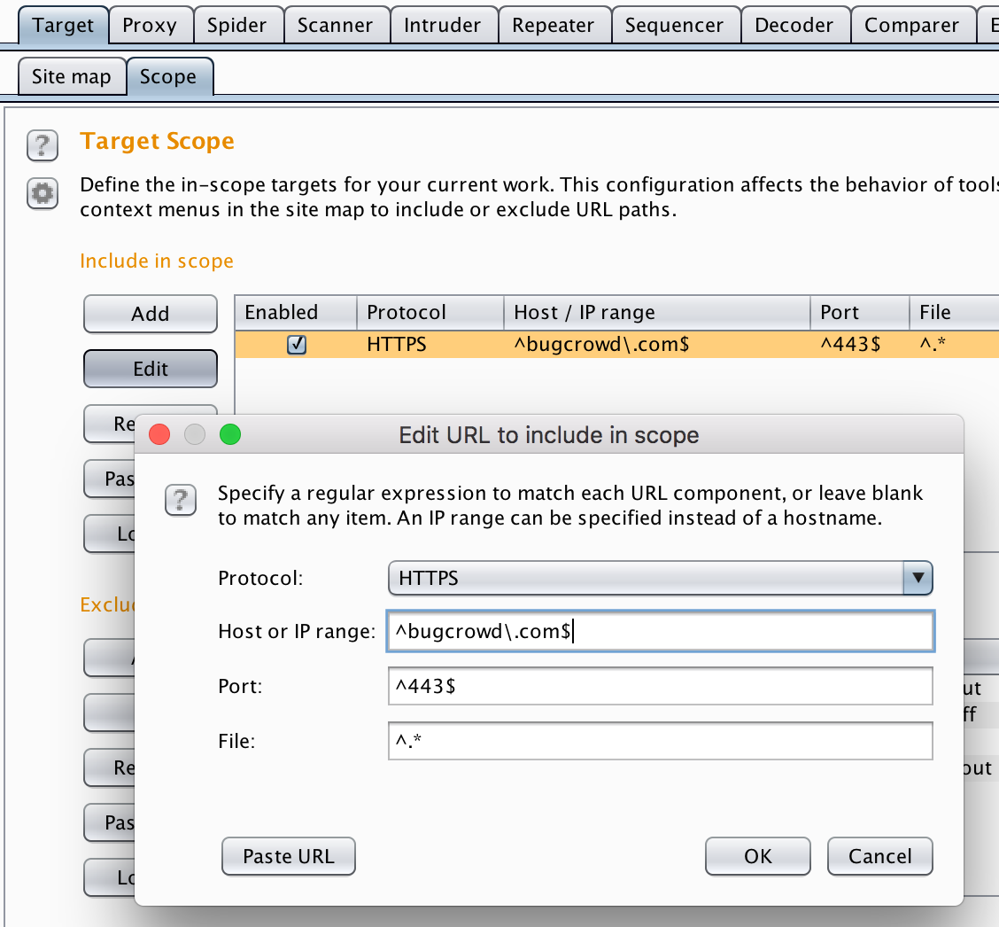
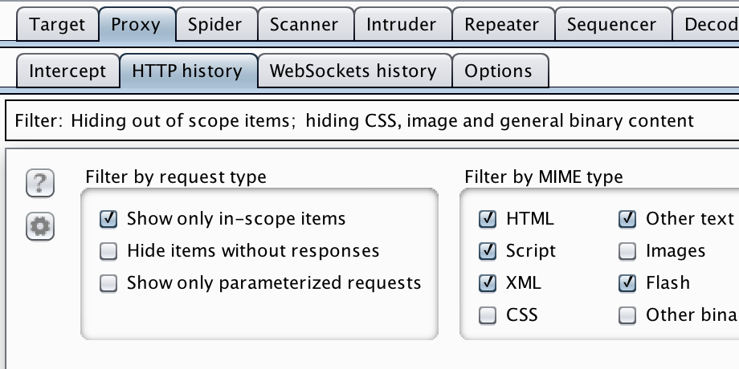
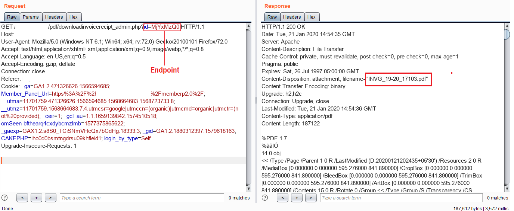
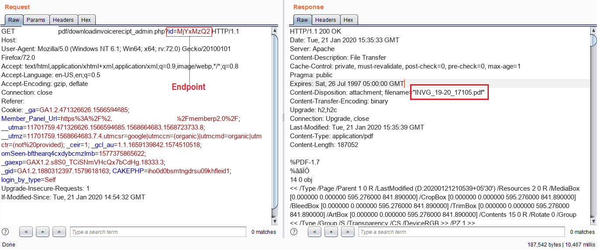
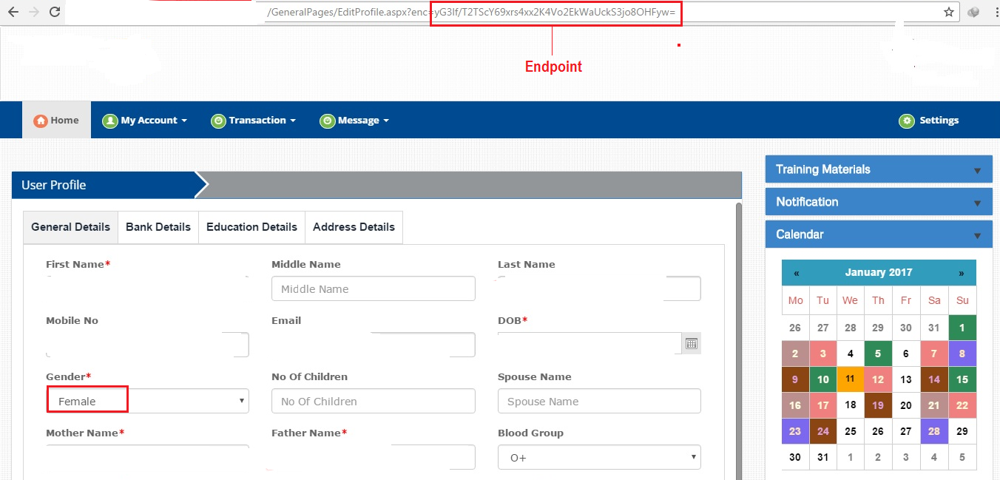
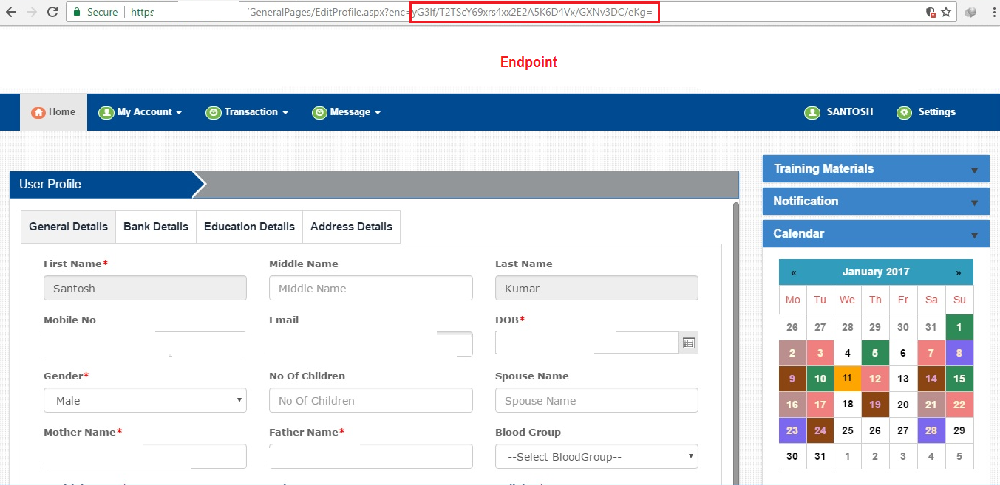
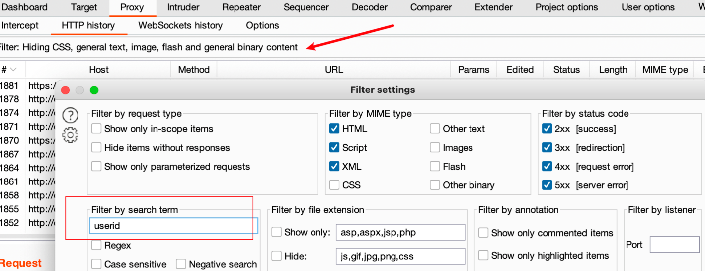
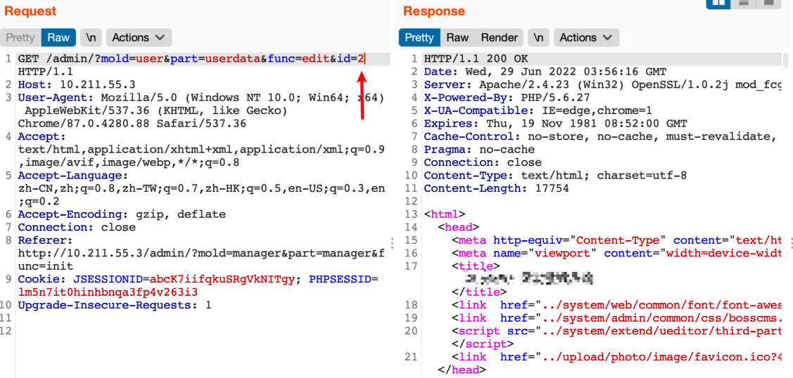
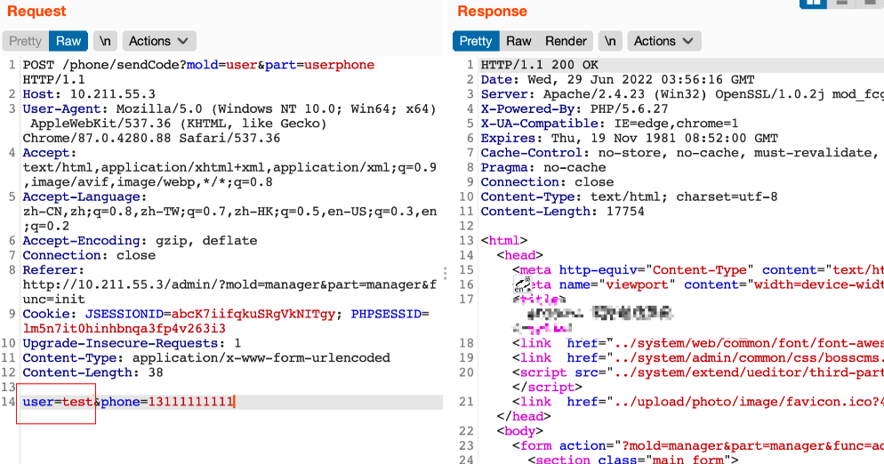

# 如何挖掘
## 如何设置bp
使用 burp suite 的 http history 选项卡来检查所有请求。http 历史记录功能显示设备（浏览器、手机、平板电脑）和应用程序服务器之间的所有流量。此外，您可以使用 burp suite 的范围功能进行快速测试。
例如; 我们测试的目标为“bugcrowd”，范围仅在范围页面上以“bugcrowd.com”的形式给出。在这种情况下，您可以通过右键单击请求来添加相关范围。


您可以根据给定的范围编辑此添加的范围值，如下所示。



最后，应该通过选择“仅显示范围内的项目”在 http 历史记录选项卡中执行以下过滤。




[不放心,还可以去除噪音](https://mp.weixin.qq.com/s?__biz=MzIzMTIzNTM0MA==&mid=2247485601&idx=1&sn=00e14aaae2e6a14fbfbe254cc66f59e6&chksm=e8a602c2dfd18bd44b8f90e9eca8325e893416a8eb0f1a95f732eda8d768b4a070e61c0977ce&token=225772138&lang=zh_CN#rd)


# 角度1:按照功能来分
添加用户(此时需要有管理员权限来测试)功能;  <br>
越权删除用户/删除其他用户的某个属性 <br>
重置密码功能; <br>
删除/上传 照片和相册; <br>
编辑/泄露/查看视频; <br>
插入删除评论; <br>
查看他人付款数据; <br>
访问其他用户附件; <br>
越权使得其他用户登出 <br>
https://hackerone.com/reports/56511

访问共享链接，则下载所有附件 <br>
订单中数据泄露 <br>


# 角度2
## 基于用户ID的越权
举个例子：

https://www.xxx.com/user1/userinfo.php?user_id=user1 <br>
https://www.xxx.com/user1/userinfo.php?user_id=10001 <br>
我们登陆某个系统后，看到某些功能上获取信息的方式类似于上链接时，可以初步判断获取信息的方式为根据user_id来获对应的用户信息，如果参数为用户名，我们可以手机用户名字典来枚举信息，根据返回值判断是否存在问题。当然如果枚举较大，系统用户数量又不是很多的情况下，可以尝试注册新用户，利用新用户的用户名来测试是否可以获取到用户信息。 <br>

如果参数为一个固定的数字串时，遍历数字串即可，这种情况下是系统对每个注册用户进行了一个用户id的排序，在众多的开源CMS上都有使用，当然这个字符串也有可能是随机，如果是随机的，量不大的情况下可以采用遍历的形式获取，量较大可以利用burp的随机数爆破，或者同样自己注册账户来测试。<br>


## 基于功能对象ID的越权
举个例子： <br>

https://www.xxx.com/user1/userticket.php?user_order=100001  <br>
https://www.xxx.com/user1/userticket.php?user_order=49ba59ab  <br>
此问题大量存在于用户订单、购买、查询等功能的商家CMS上，例如以上地址，如果user_order是订单编号，那么我们可以尝试遍历订单地址来查询是否存在越权。如果编号并不是单纯的订单数字串，而是类似如上的编码字符串，相信自己的运气的话可以尝试某些编码的情况，例如BASE64、MD5。猜测不到，或者不能明显的看出来是如果做的处理，注册新账号重新下单，会是简单方便的选择。


## 基于未授权访问的越权
举个例子：  <br>
https://www.xxx.com/user1/user.php?user=user1@user.com  <br>
在一些系统上登陆用户后，可以看到类似如上的地址链接，可能你会觉得这个跟问题1类似，但是也有可能多一张问题情况，在非登陆的情况下仍然可以访问到详细信息。如果可以，则证明后端对身份的效验只是基于参数user，并没有效验用户的session是否已登陆。此问题曾发现于一个系统后端支付订单复核的功能中，问题可想而知。

## 基于功能地址的越权
举个例子： <br>

https://www.xxx.com/user/getuserinfo.php <br>
如上地址，正常情况下，只访问此后台地址时，一般会跳转到登陆地址，或者登陆后用来查看某个具体的功能，获取数据的情况根据访问的链接地址来，理论上此功能并不存在越权可能，因为没有我们可以修改的参数。但是对权限及功能的限制可能只局限于用户菜单的限制，根据常用链接，可以猜测是否存在以下地址：


```
/getuserorder.php
/adduser.php
/deluser.php
/getalluser.php
/todetailpage.php
/ordercreate.php
......
```
因为在绝大部分系统中，开发为了方便区别功能和页面，通常会利用对应的英文来命名文件，但这些文件并不是任意用户都可以访问到的，所以可以猜测访问地址是否英文的拼接来猜测路径。对于此问题的快捷测试是获取一个高权限账号，当然对于未授权测试来说，很难实现。

## 基于接口身份的越权
举个例子：

```
https://www.xxx.com/user/userinfo.php
post: {'userid':'10001','username':'name','userage':'18','usermobile':'18080808888'}
```
例如如上接口，修改用户信息，当我们点击某个系统的修改自身资料时，会发送一个类似的json数据包，其中userid对应我们自己的用户id，修改后，可以修改对应id的用户资料。修改方式类似问题1。区别在于一个页面可见，一个页面不直观可见，一个查询，一个修改。需要配合其他越权查询漏洞，或者账号来识别是否修改成功。


## 基于上传文件对象ID的越权
举个例子：

https://www.xxx.com/user1/userfile.php?fileid=10001
https://www.ccc.com/user1/userfile.php?fileid=user1_name.jpg
这种上传文件后，可以越权查看其他用户的上传文件也是经常发现类似的问题。假设，系统要求我们上传个人的身份证，实名认证信息、购买的发票订单等。如果上传后看到类似如上地址，可以猜测此上传文件可以遍历获取，同过查询fileid来查看其他用户的上传信息。如果上传后文件名如第二种，可能此文件是系统经过重命名的，重命名的方式一般采用当前上传的时间戳或者当前上传的日期加随机字段，这种情况下枚举较为困难，但仍然可以采用注册新用户的方式来查看是否存在越权。顺便一问，如果是www.ccc.com获取信息的方式，还可能会有什么问题呢？

# 角度3
https://dewcode.medium.com/my-bug-hunting-journey-with-idors-part-2-422a737fb733#:~:text=GUID%2FUUID%20based%20IDOR,-This%20type%20of&text=The%20server%20generates%20GUID%2FUUID,bug%20as%20a%20security%20issue

## 基于 Base64 的 IDOR
测试此类问题需要先解码base64，修改后编码成base64，放入URL参数。可以使用 Burp Suite 执行此操作。



当我将参数值更改为修改后的值时，能够下载其他用户发票。



## 基于 GUID/UUID 的 IDOR
服务器为每个用户生成不可预测的GUID/UUID 。 要利用这种类型的 IDOR，您必须创建另一个帐户并交换GUID/UUID。许多漏洞赏金计划并不认为这种类型的漏洞是安全问题。在报告这种类型的 IDOR 之前，必须找到另一个可以检索其他用户 UUID 的端点
如图所示，应用程序在 URL 中公开了用户 GUID，但无法修改参数值。


登录另一个用户帐户/创建另一个帐户 > 复制该用户 GUID > 交换它。可以看到我能够访问受害者的个人资料。



## 小结
始终查看 id、uid、name、role、email、appid、invoice_id 和任何 CRUD（创建、读取、更新、删除）操作。您必须监控所有请求和参数以在测试时检测 IDOR。

# 角度4
## 未使用cookie鉴权
通过修改userid等字段进行越权。首先需要在大体方向上判断，整个系统的功能点，有没有通过userid等参数值进行校验的。常见方式便是通过全局搜索userid、id、countid等字符，通过修改对应id值进行判断。


例如此处获取用户数据功能，如果未检测用户id是否与cookie对应。那么便可以通过枚举用户id，获取其他用户数据。



或者在某个获取验证码功能，通过修改user字段值，伪造代替其他用户获取验证码进行越权操作。




## 使用cookie鉴权
第一种、拥有两个账号密码的情况下，使用管理员账号操作，抓取数据包，修改cookie为普通用户的cookie
第二种、只有普通账号的情况下，通过js文件发现接口，通过自主访问接口，fuzz字段值进行越权测试

# 角度5
从绕过的角度:
[IDOR测试常见绕过技巧小结](https://mp.weixin.qq.com/s?__biz=MzIzMTIzNTM0MA==&mid=2247485843&idx=1&sn=09ae2cab8b4ed30dfc7c5d4e48073b42&chksm=e8a603f0dfd18ae631cf3b14cd19f9e1767cc93a3375e644d459fb31630f874cadbba492dff3&token=225772138&lang=zh_CN#rd)

# 角度6
从graphql <br>
https://mp.weixin.qq.com/s/gp2jGrLPllsh5xn7vn9BwQ  <br>
相关writeup: <br>
https://hackerone.com/reports/980511 <br>
https://hackerone.com/reports/172837 <br>
https://hackerone.com/reports/898528 <br>
https://hackerone.com/reports/700831 <br>
https://hackerone.com/reports/397130  <br>


## 参考
https://blog.mert.ninja/idor/

https://misakikata.github.io/2019/06/%E8%B6%8A%E6%9D%83-%E6%9C%AA%E6%8E%88%E6%9D%83%E8%AE%BF%E9%97%AE/

https://xz.aliyun.com/t/11500#toc-12