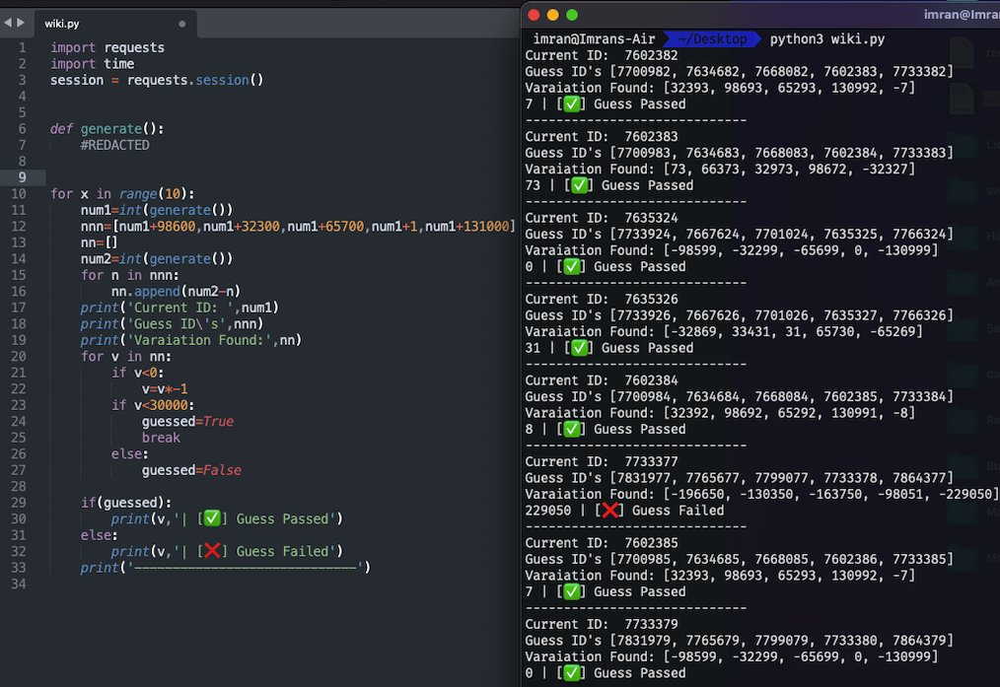
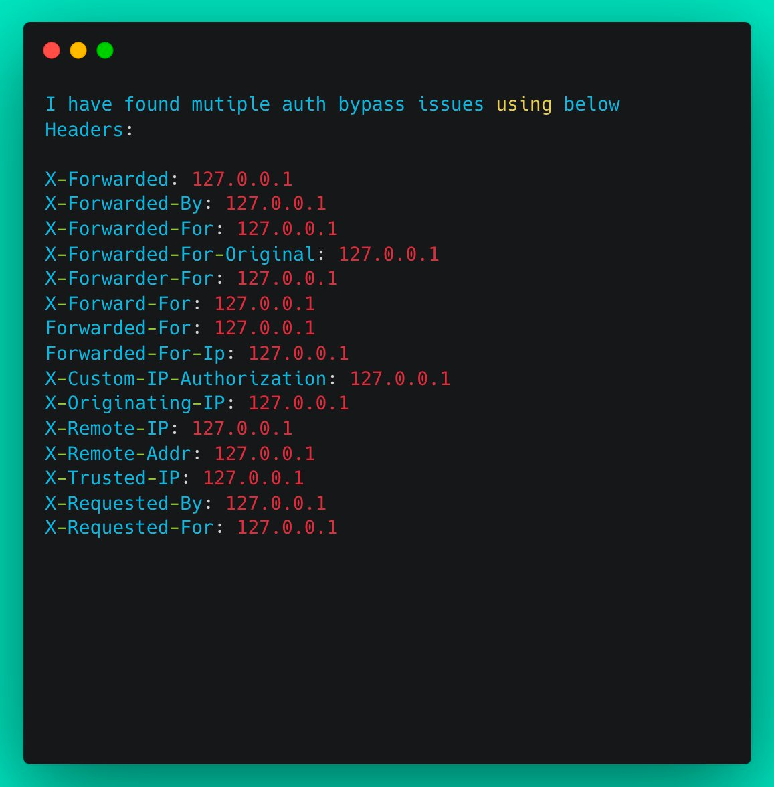
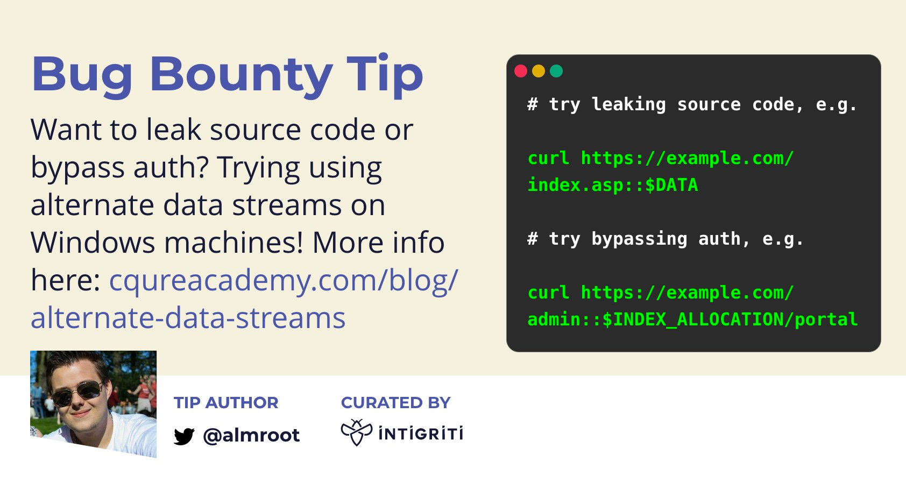

## uuid  post

https://twitter.com/m4ll0k/status/1310439013581549568

主要是存在uuid的post请求

## an interesting idor

https://twitter.com/imranparray101/status/1553360991970553857

I  came across an interesting IDOR/BAC vulnerability that required a random ID to exploit.

I discovered that the next ID is generated by incrementing the previous ID with 90600,32300,65700 and a few more numbers.

I quickly wrote this POC that guesses the next ID.

## auth bypass (403 bypass)
https://twitter.com/BountyOverflow/status/1555786315232206848

https://mobile.twitter.com/BountyOverflow/status/1555786315232206848

Server set up in such a way that it gives access to only local systems.
And server does this by checking if the request is coming from a local ip (127.0.0.1)
These headers help us trick the server that the request is coming from some internal system as the ip is spoofed as 127...

服务器设置为只允许访问本地系统。
服务器通过检查请求是否来自本地 ip (127.0.0.1) 来执行此操作
这些标头帮助我们欺骗服务器，该请求来自某个内部系统，因为 ip 被欺骗为 127...

https://twitter.com/J0nah2004/status/1555982872917549058

Either a bad config or the website is used for both, external and internal connections. For example: Youvhave a website „http://domain.com“ you want that domain to be your official site for your company. To prevent hacking, you only allow local connections to (1/*)

edit your website. For that you use „http://domain.com/edit“. If a normal user tries to use „http://domain.com/edit“ they get a 403.
(2/*)

After a while you get tired of always having to input your admin pw. Because the website only allows local connections you decide it’s safe to disable the admin login altogether.
(Or you have a weak admin pw and don’t disable the login. Still more or less the same issue.) (3/*)

If now a hacker (or in a best case a pentester) comes around, and they set the headers to to spoof their IP to appear as 127.0.0.1, they can now access the admin panel. (4/4)

## auth-bypass-tip

https://twitter.com/intigriti/status/1436655772058927106/photo/1

