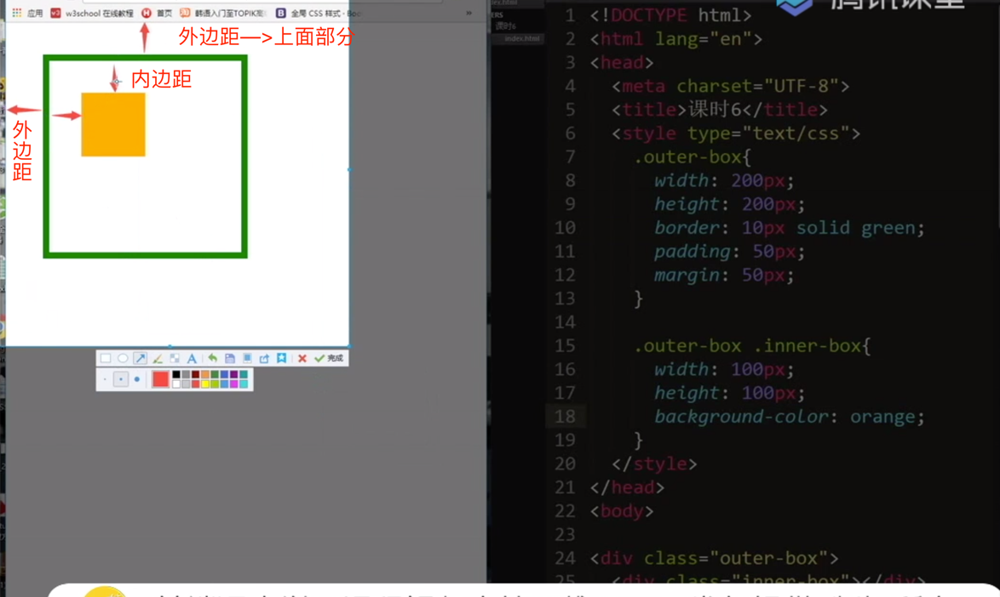
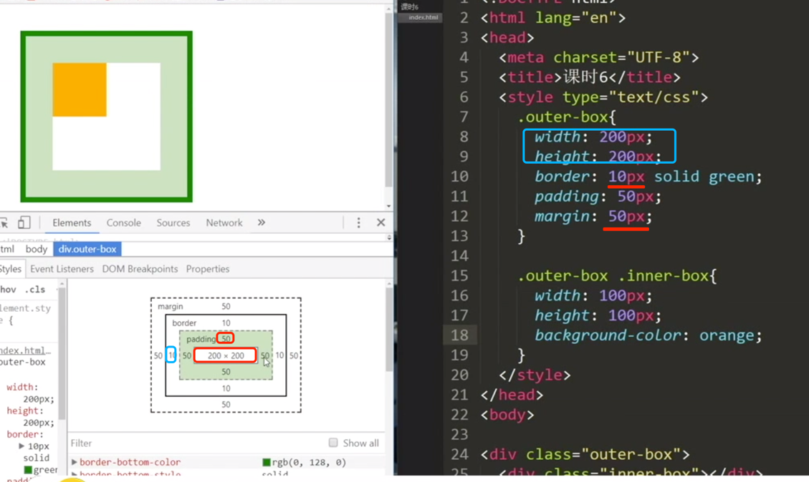
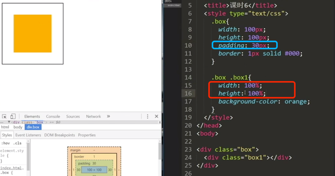
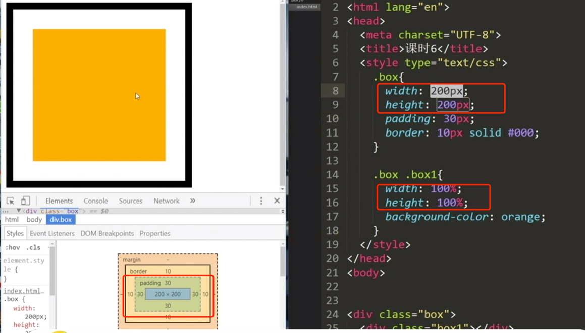
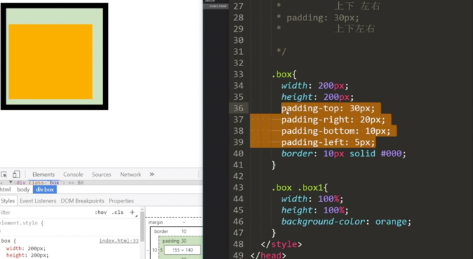
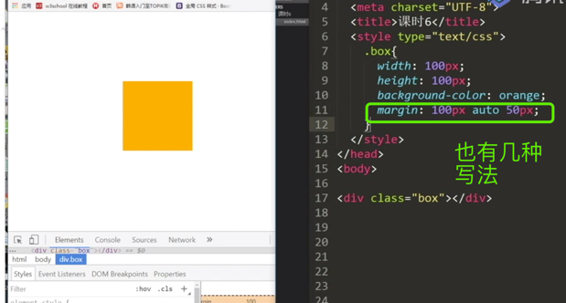

## 盒子模型

四大要素:

1.宽高所划分的区域;

2.边框

3.内边距： padding

4.外边距： margin

内边距和边框是不占据盒子本身的宽和高的;

可视区域宽/ 高: `宽/高  + padding(内边距) *2 + border(边框)*2`

居中方案:

### 下面这种记住:(内部盒子居中问题)

外层盒子固定宽高,内层盒子宽高100%(这是继承外层盒子的)， 外层盒子再给一个padding;

### 解决可视尺寸问题

目前可视尺寸为280px;

但是想要可视尺寸只有200px呢(利用box-sizing:border-box):

就是将边框和内边距收到盒子内部

### padding相关的属性:

### 盒子居中问题

上面这是盒子相对浏览器水平居中的;

浏览器默认的margin是8;

## 定位

### 绝对定位
- position: absolute;

- left|right，top|boottom: 基准线不一样

- 相当于新建图层，绝对定位的元素到另外一层去了，位置就会被占据

