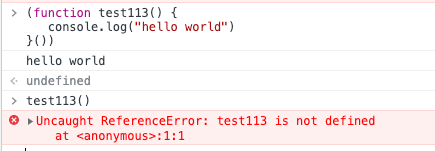
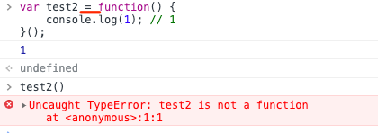
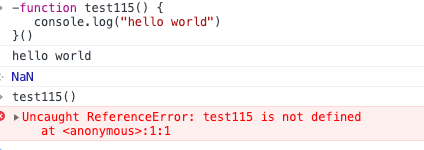
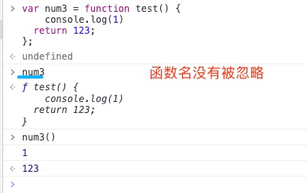

[TOC]

## 前言

自动执行,执行完之后立即释放(就是说这个函数执行完之后自动销毁, 你再次调用的时候会报 ReferenceError的错误); <br>
IIFE: immediately-invoked function expression

三种基本写法:

```javascript
//第一种
(function () {

})(); // 看着清晰

// 第二种
(function () {

}()); // W3C建议,推荐

// 第三种
+function test() {

}()


  // 1、简单示例
  // 用括号包裹匿名函数：因为括号包裹的是函数表达式，前后需要加分号
  (function () {
    var a = 1;
    var b = 2;
    console.log(a + b); // 3
  }());


// 2、参数问题
(function (a, b) { // 形参
  console.log(a + b); // 3
}(1, 2)); // 实参


// 3、返回值：用变量接受表达式
var num = (function (a, b) {
  return a + b;
}(1, 2));

console.log(num); // 3

```

## 表达式执行

（1）括号包起来的一定是表达式

```javascript
// ==>   (funiton test(){})

```

（2）一定是表达式才能被执行符号执行

```javascript
// 被执行
(function test1() {
  console.log(1); // 1
})();

// 被执行,有=号，它是一个表达式
var test2 = function () {
  console.log(1); // 1
}();

// 因为执行完毕即可销毁，外部调用不到test2函数
console.log(test2())//Uncaught TypeError: test2 is not a function

// 不传参报错，不是一个表达式，原因：JS引擎认为不传参数就是不是表达式
// 报语法错误：Uncaught SyntaxError: Unexpected token )
// function test3() {
//     console.log(1);
// }(); // 没传参

// 传入参数不报错，但不执行，原因：JS引擎认为传了参数就是表达式
function test5(a) {

}

test5(6);  // 传参

```

（3）立刻执行函数：自动执行、执行完成以后立刻释放

```javascript
// 括号包裹-会报错
(function test() {
  var a = 1;
  var b = 2;
  console.log(a + b); // 3
}());
// 因为执行完毕即可销毁，外部调用不到test函数
console.log(test()); // Uncaught ReferenceError: test is not defined

// 表达式-不会报错
var test1 = function () {
  console.log(2); // 2
}();
console.log(test1); // undefined

```

（4）如果函数变为表达式，函数名就会被忽略

```javascript
// 匿名函数
var num = (function () {
  return 123;
})();
console.log(num); // 123

// 忽略函数名
var num = (function test() {
  return 123;
})();
console.log(num); // 123

```

（5）函数声明变为表达式的方法，在表达式前加 +、-、!、||、&&

```javascript
// 1、函数声明：function test(){}
// 2、函数声明变为表达式(前面加符号)：+function test(){}
// 3、表达式立刻执行(末尾加括号)：+function test(){}()
+function test() {
  console.log(1);//1
}();

1 && function test() {
  console.log(1);//1
}();


//逗号也是一个运算符
var num1 = (1, 2)
console.log(num1)//2,总是最后一个数字
var num2 = (1, 2, 3)
console.log(num2)//3
```

### 表达式小结

1.有括号;

2.有=号.

3.函数声明前面加 +、-、!、||、&&

## 立刻执行函数-经典面试题

```javascript
//先上简单的:
function testf() {
  var n = 10;
  var a = function () {
    console.log(n)
  }

  var b = function () {
    console.log(n);
  }
  return [a, b];
}

//testf执行完之后,testf的AO并没有销毁,
// (testf的AO里面还是包含n=10的)
//testf的AO还被a,b两个函数拽着
var arr = testf();
console.log(arr[0]());//10

```

上菜:

```javascript
function test() {
  var arr = [];

  for (var i = 0; i < 10; i++) {
    // 赋值语句，系统定义的时候为函数引用，访问不到里面的值
    // 只有在外部执行的时候才会看到里面的i值
    arr[i] = function () { // 匿名函数
      document.write(i + ' ');
    }
  }

  // for循环 等价
  // var i = 0;
  // for(; i < 10; ) {
  //     arr[i] = function() {
  //         document.write(i + ' ');
  //     }
  //     i++;
  // }

  return arr;
}

var myArr = test();
console.log(myArr); // 10个匿名函数 [ƒ, ƒ, ƒ, ƒ, ƒ, ƒ, ƒ, ƒ, ƒ, ƒ]
console.log(myArr[0]===myArr[1])//false

for (var j = 0; j < 10; j++) {
  myArr[j](); // 10 10 10 10 10 10 10 10 10 10
}


// 答案： 10个10
// 原因：
// 1、test中的for循环，在arr中存放了10个匿名函数，但是没执行
// 2、当for循环完毕之后，test函数中AO存放的i变量已经变为了10
// 3、当return arr的时候，形成了10个闭包，即10个匿名函数，虽然test的AO被销毁，但是返回的每个匿名函数中都有test的AO
// 4、当在外部for循环调用每个匿名函数的时候，输出的i都是10
```

如果想打印0-9，的解决方法：

```javascript
// 第一种方法：需要立刻执行函数
function test() {
  //var arr = [];

  for (var i = 0; i < 10; i++) {
    // 改为立刻执行函数
    (function () {
      document.write(i + ' ');
    }());
  }

  //return arr;
}

test();


// 第二种方法：外部传入
function test() {
  var arr = [];

  for (var i = 0; i < 10; i++) {
    arr[i] = function (num) {
      document.write(num + ' ');
    }
  }

  return arr;
}

var myArr = test();
console.log(myArr); // [ƒ, ƒ, ƒ, ƒ, ƒ, ƒ, ƒ, ƒ, ƒ, ƒ]

for (var j = 0; j < 10; j++) {
  myArr[j](j); // 0 1 2 3 4 5 6 7 8 9
}


// 第三种方法：立刻执行保存值(最常用)==>非常经典的方法
function test() {
  var arr = [];

  for (var i = 0; i < 10; i++) {
    // 实际循环立刻执行函数：立刻执行函数保存i值
    (function (j) {//注意:这里的j是立即执行函数的形参!!!
      // 立即执行函数AO中的 j = 0, 1, 2, 3......
      // 每个立刻执行函数中都有一个唯一的j值
      arr[j] = function () {
        // 访问的是立刻执行函数AO中的j值：0, 1, 2.... 
        document.write(j + ' ');
      }
    })(i);
  }

  return arr;
}

// 上面的for循环可以这么理解:
for (var p = 0; p < 10; p++) {
  (function (j) {
    //具体逻辑
    //...
  })(p)
}

var myArr = test();
console.log(myArr); // [ƒ, ƒ, ƒ, ƒ, ƒ, ƒ, ƒ, ƒ, ƒ, ƒ]

for (var j = 0; j < 10; j++) {
  myArr[j](); //0 1 2 3 4 5 6 7 8 9
}


```

经典题2:

```javascript

var a = 10;
if (function b() {}) {//分析:一个函数如果被括号括起来,那么就是一个表达式
                      //被当做表达式的时候,其函数名就可以被忽略
                      //b只要被忽略,放到typeof中就是undefined
                      //一般而言b不声明就会报referenceError,除非前面有typeof
  a += typeof (b);
}
console.log(a);//10 undefined
```


## 立即执行










这里不讨论函数:

立即执行的一定是表达式


非法符号:


## 小结

注意下面两者:

```js
//下面这个叫立即执行函数
var test111 = function() {
  console.log(1); // 1
}();


// test111()//TypeError: test111 is not a function

//下面这个叫做函数表达式(详见mdn:https://developer.mozilla.org/zh-CN/docs/Web/JavaScript/Reference/Operators/function#:~:text=%E5%87%BD%E6%95%B0%E8%A1%A8%E8%BE%BE%E5%BC%8F%EF%BC%88function%20expression,%E5%8C%BF%E5%90%8D%E5%87%BD%E6%95%B0%EF%BC%88anonymous%20functions%EF%BC%89%E3%80%82 )
var test112 = function() {
  console.log(1); 
};

test112()//1
```

得出结论: 

0.立即执行的一定是表达式,但是表达式不一定立即执行


1.表达式与立即执行函数(函数前面有以下符号):

- 有括号;

- 有=号(这里有等号一定要小心,这里指的是下面这种情况).
```js
var test111 = function() {
  console.log(1); // 1
}();

```

- 函数声明前面加 !、+、-、~

一定是表达式才能被执行符号执行(注意:表达式不一定立即执行); <br>
立即执行函数(立即执行函数特点:function后面一般有两个`()`)是指:自动执行,执行完之后立即释放(就是说这个函数执行完之后自动销毁, 你再次调用的时候会报 ReferenceError的错误);

2.立即执行函数的作用(后面有一条对应的面试题)  <br>
- 不必为函数命名，避免了污染全局变量。

- 立即执行函数内部形成了一个单独的作用域，可以封装一些外部无法读取的私有变量。

- 封装变量。


最后的面试题:

```js
var list = document.getElementById("list");
var li = list.children;
for(var i = 0 ;i<li.length;i++){
  li[i].onclick=function(){
    alert(i);  // 结果总是3.而不是0，1，2
    }
}
```

因为i是贯穿整个作用域的，而不是给每一个li分配一个i，点击事件使异步用户一定是在for运行完以后才点击，此时i已经变成3了。

解决方法：

1、使用立即执行函数，给每个li创建一个独立的作用域，在立即执行函数执行的时候，i的值从0到2，对应三个立即执行函数，所以就能正常输出了。

```js
var list = document.getElementById("list");
    var li = list.children;
    for(var i = 0 ;i<li.length;i++){
      (function(j) {li[j].onclick=function(){
        alert(j);  // 结果是0，1，2
      }})(i)
    }
```

2、使用ES6的块级作用域:(这里参考一下作用域和作用域链那边的块级作用域)

```js
var list = document.getElementById("list");
var li = list.children;
for(let i = 0 ;i<li.length;i++){
  li[i].onclick=function(){
    alert(i);  // 结果总是3.而不是0，1，2
    }
}
```


立即执行函数的使用场景

1、代码在页面加载完成之后，不得不执行一些设置工作，比如时间处理器，创建对象等等。

2、所有的这些动作只需要执行一次，比如只需要显示一个事件。

3、将代码包裹在它的局部作用域中，不会让任何变量泄漏成全局变量。

立即执行函数的参数

```shell
(function(i) {
    ...
})(j)
```
如果立即执行函数中需要全局变量，全局变量会被作为一个参数传递给立即执行函数。j代表是实参，i代表的是执行函数的形参。


立即执行函数的作用  <br>
1、改变变量的作用域（创建一个独立的作用域）。

2、封装临时变量。


## 总结(这一节可以分2-4天讲解)

0.表达式有两种:
  - 立即执行的,一般为立即执行函数(不算大括号里面的`()`,function后面有两对小括号)
  - 不会立即执行的`var test112 = function() {
    console.log(1);
    };`，function后面没有两对小括号

1.立即执行函数特点(大前提:function后面有两个小括号):
 - function前面加 !、+、-、~,void,new
 - function被括号包起来
 - function前面有=
 - 自动执行,执行完之后立即释放(就是说这个函数执行完之后自动销毁, 你再次调用的时候会报 ReferenceError的错误);
 - 函数变为立即执行函数，函数名会被忽略(用途: 详见上面的 经典题2)




2.立即执行函数作用:
 - 立即执行函数内部形成了一个单独的作用域，外部无法读取里面的变量
   - 避免污染全局变量
   - 封装临时变量


3.window,return与立即执行函数相关的知识点(见另外一个页面)


## 参考

https://cloud.tencent.com/developer/article/1656423


