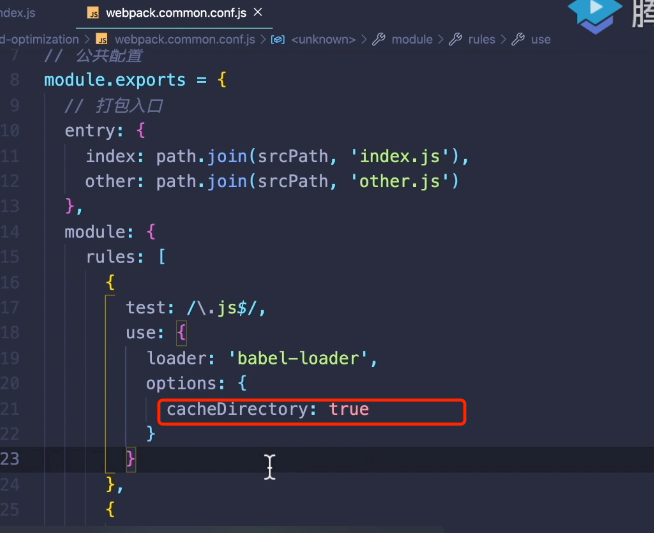
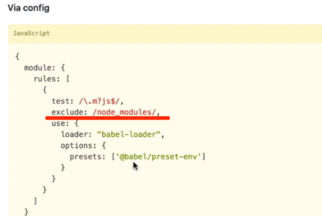

[TOC]

## 前言
优化的点:
- 优化打包构建速度
- 优化产出代码体积

## 利用缓存的机制减少需要编译的代码

```js
import a from './abc'  // [1]  babel将abc文件中的ES6编译为ES5
import b from './aaa'   // [2]  babel将aaa文件中的ES6编译为ES5

```
如果没有缓存机制,[1]要被编译2次,如果有缓存机制,[1]只要被编译1次


相关配置如下:



```js
module.exports = {
  module:{
    rules:[
      {
        test:/\.js$/,
        use:{
          loader: 'babel-loader',
          options:{
            //利用缓存来优化的配置
            cacheDirectory:true
          }
        },
        //指定哪些目录下的代码可以被编译,这里的srcPath指的是src目录下的代码
        include: srcPath,
        //排除哪些代码,这些代码是不被编译的,include与exclude二选一
        exclude: path.resolve(__diename,'node_modules')
        
      },{
      
      }
    ]
  }
}
```


下次编译的时候看缓存中有没有编译好的代码,如果有，就可以直接用,不用重新编译了;

具体详见: https://webpack.js.org/loaders/babel-loader/

注意,这个只对js有效果!!!

path.js:

```js
const path = require('path');

const srcPath = path.join(__dirname,'..','src');
const disPath = path.join(__dirname,'..','dist');

module.exports = {
  srcPath,
  distPath
}
```

### 小结1(需要记忆)

babel可以优化的点:(可以提升打包的速度)

- 指定哪些文件可以被编译，哪些可以不被编译(include/exclude)
- 定义缓存: `cacheDirectory:true`

## 优化场景2

引入某个包,这个包里面包含很多功能模块,但是我在项目中知识需要其中某一个功能模块;

例如下面这个例子:引入了语言包,里面包含了各个国家的语言,但是我只是需要中文的


02.Webpack性能优化（二） 继续


