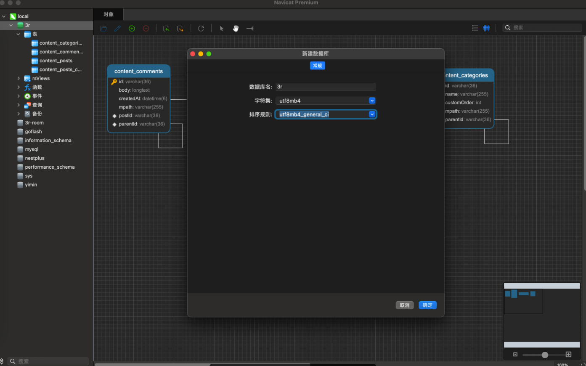
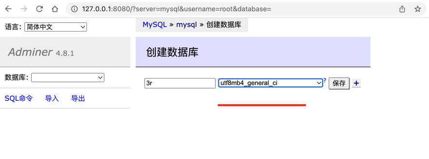

https://pincman-classroom.feishu.cn/wiki/wikcnmha4eHAfhWauw3dobe3v3p

## Mysql相关配置与安装

开启docker之后

```shell
#项目地址是在 /Users/mac/WebstormProjects/fullstack/nest-events-backend  里面
#主要是要开启 nest-events-backend  这个服务,在master-nest里面的
#用户名字和密码是:root,  example

```
在  `/Users/mac/WebstormProjects/fullstack/nest-events-backend`这个地址
有一个`docker-compose.yml `的文件

```shell
version: "3.8"

services:
  mysql:
    image: mysql:8.0.23
    command: --default-authentication-plugin=mysql_native_password
    restart: always
    environment:
      MYSQL_ROOT_PASSWORD: example
    ports:
      - 3306:3306

  postgres:
    image: postgres:13.1
    restart: always
    environment:
      POSTGRES_PASSWORD: example
    ports:
      - 5432:5432

  adminer:
    image: adminer
    restart: always
    ports:
      - 8080:8080

```

3r里面并不是这样的,如下:

```shell
~ brew update
~ brew install mysql
# 启动服务
~ brew services start mysql
# 重启服务
~ brew services restart mysql
```
执行初始化

密码建议12345678这种简单点的

```shell
~ mysql_secure_installation
```
尝试登录

```shell
~ mysql -u root -p #回车后输入你的密码
```

下载一个数据库管理工具,这里推荐使用Navicat(收费的)，建议可以去这个网站(https://appstorrent.ru/)看看，下载后连接数据库，并新增一个库(比如3r)



注意:如何进mysql服务

```shell
⇒  docker exec -it 226741c1aa6e bash
root@226741c1aa6e:/# which mysql
/usr/bin/mysql
root@226741c1aa6e:/# mysql -u root -p
Enter password:example
```



## 依赖库

安装以下库
- lodash是常用的工具库
- typeorm一个TS编写的node.js ORM
- @nestjs/typeorm Nestjs的TypeOrm整合模块
- mysql2是Node的Mysql操作库
- sanitize-html过滤html标签,防注入攻击
- deepmerge是一个用于深度合并对象的库

```shell
 pnpm add lodash mysql2 typeorm @nestjs/typeorm sanitize-html deepmerge
 pnpm add @types/lodash @types/sanitize-html
 
```


## 代码编写

```shell
mkdir -p src/modules/core
mkdir src/modules/database

```

## 核心代码

这节课程core目录下并没有编写模块,而是存放一些公共类型和工具函数,这一节暂时用不到,不过先写几个工具函数也无妨

```shell
// src/modules/core/helpers/utils.ts
/**
 * 用于请求验证中的boolean数据转义
 * @param value
 */
export function toBoolean(value?: string | boolean): boolean {
    if (isNil(value)) return false;
    if (typeof value === 'boolean') return value;
    try {
        return JSON.parse(value.toLowerCase());
    } catch (error) {
        return value as unknown as boolean;
    }
}

/**
 * 用于请求验证中转义null
 * @param value
 */
export function toNull(value?: string | null): string | null | undefined {
    return value === 'null' ? null : value;
}
```
在index.ts中导出utils.ts里面的函数，因为目前我们使用的是CommonJS模式(nestjs目前不支持ESM)，所以后续直接可以使用导入helpers目录的方法来导入这些在子文件中导出的东西

```shell
// src/modules/core/helpers/index.ts
export * from './utils';
```

## 数据库模块
本模块就是用来连接数据库以及编写一些数据库操作需要的东西

## 数据库连接

首先我们写一些接口和类型，先不必去管他干嘛用的，后面会用到，看注释知道个大概

```shell
// src/modules/database/types.ts

/**
 * 为queryBuilder添加查询的回调函数接口
 */
export type QueryHook<Entity> = (
    qb: SelectQueryBuilder<Entity>,
) => Promise<SelectQueryBuilder<Entity>>;
```


接下来我们编写DatabaseModule模块，用来连接数据库
这里我们通过动态模块的方式来传入配置，可以看到我们使用了传入配置函数的方式而不是直接传入配置，这是因为直接传入静态配置会导致出现很多问题，比如后面的环境变量读取等，这对我们后续编写自己的配置系统这些课程会有一个理解上的帮助


```shell
// src/modules/database/database.module.ts
import { DynamicModule, Module, Provider, Type } from '@nestjs/common';
import { getDataSourceToken, TypeOrmModule, TypeOrmModuleOptions } from '@nestjs/typeorm';
import { DataSource, ObjectType } from 'typeorm';

@Module({})
export class DatabaseModule {
    static forRoot(configRegister: () => TypeOrmModuleOptions): DynamicModule {
        return {
            global: true,
            module: DatabaseModule,
            imports: [TypeOrmModule.forRoot(configRegister())],
        };
    }
}
```


