## 06th_character_28th_class

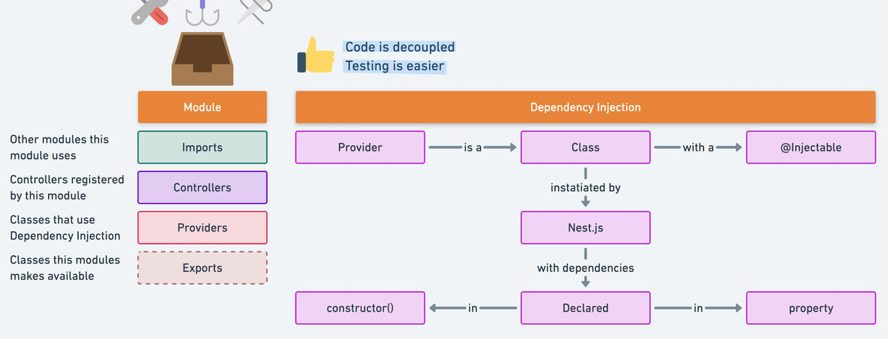

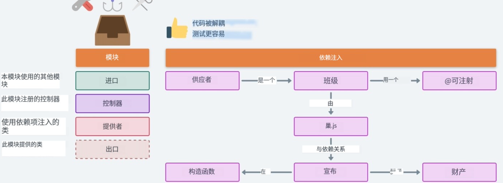

## 创建模块

```shell
#创建一个名为events的模块
⇒  nest g mo events
```

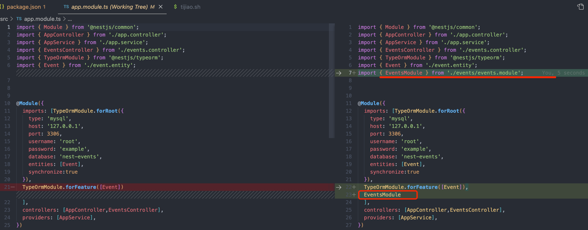


## 35th exception filters

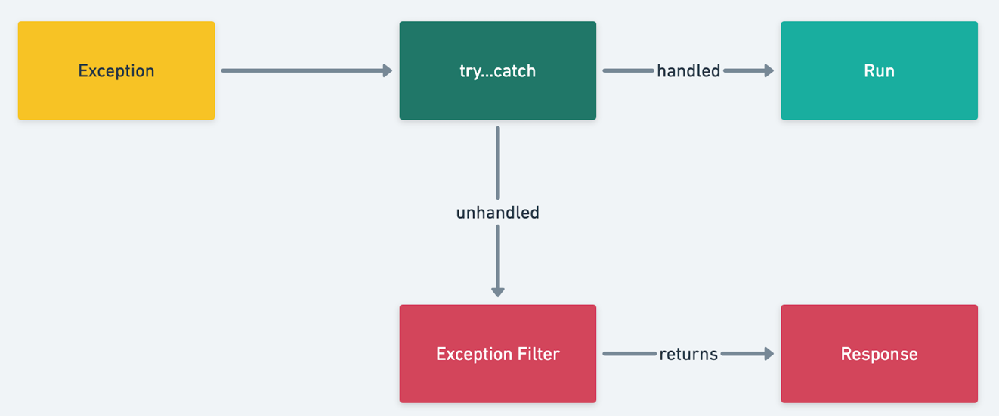


## 36th_relations


## 37th_one_to_many_有个注意点

Attendee在设置之前:

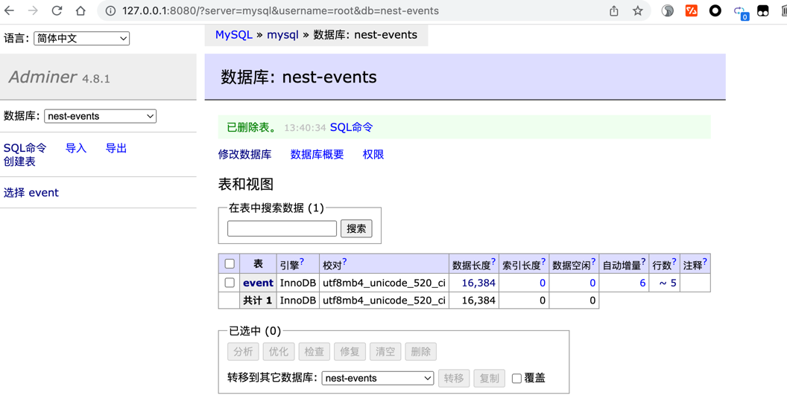

设置之后:(注意:这里如果不设置会报缺少Attendee这个表的元数据的错误!!!)

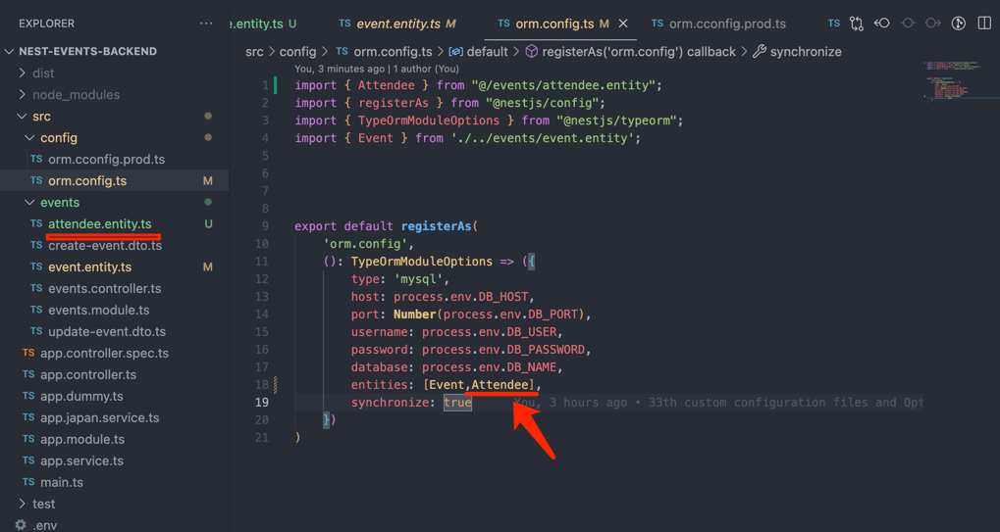

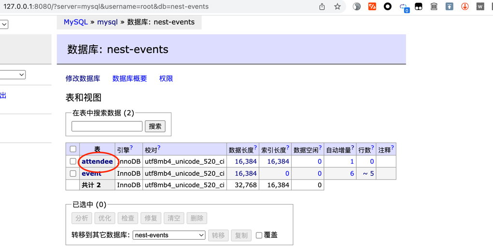

注意对比下面这两个情况:


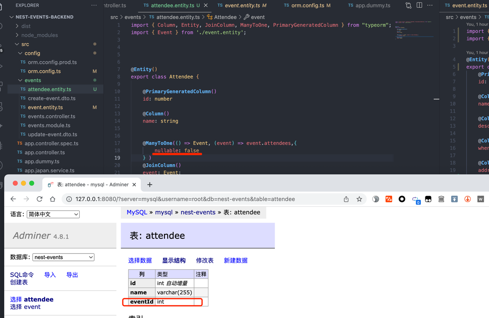

## 38th_loading related entities

给attendee表填充数据:

```shell


INSERT INTO
    `attendee` (`id`, `name`, `eventId`)
VALUES
    (1, 'Piotr', 1),
    (2, 'John', 1),
    (3, 'Terry', 1),
    (4, 'Bob', 2),
    (5, 'Joe', 2),
    (6, 'Donald', 2),
    (7, 'Harry', 4);

```

## 39th_associating_related_entities

attendee表被编辑之前

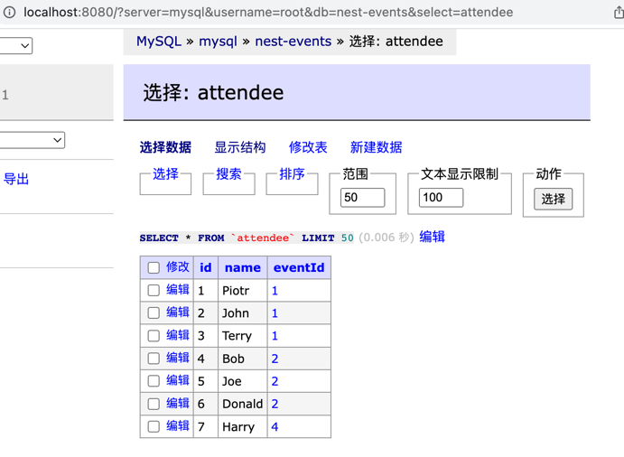

attendee表被编辑之后:

测试:
```shell
⇒  curl http://localhost:3000/events/practice2
{"id":1}%
```

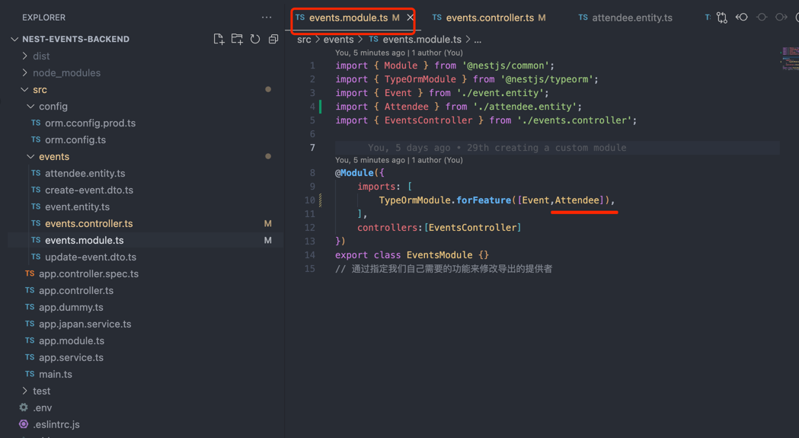


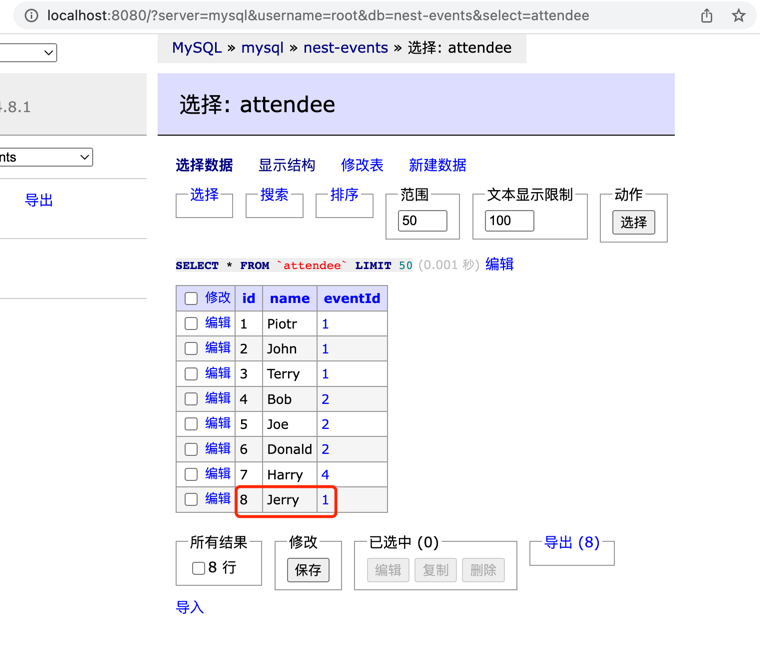


## 40th_many_to_many

创建模块:

```shell
nest g mo school
```

数据库里面的JoinTable操作对比:

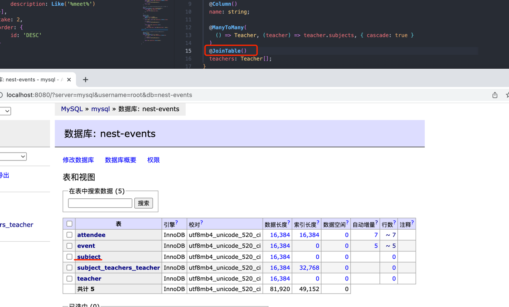

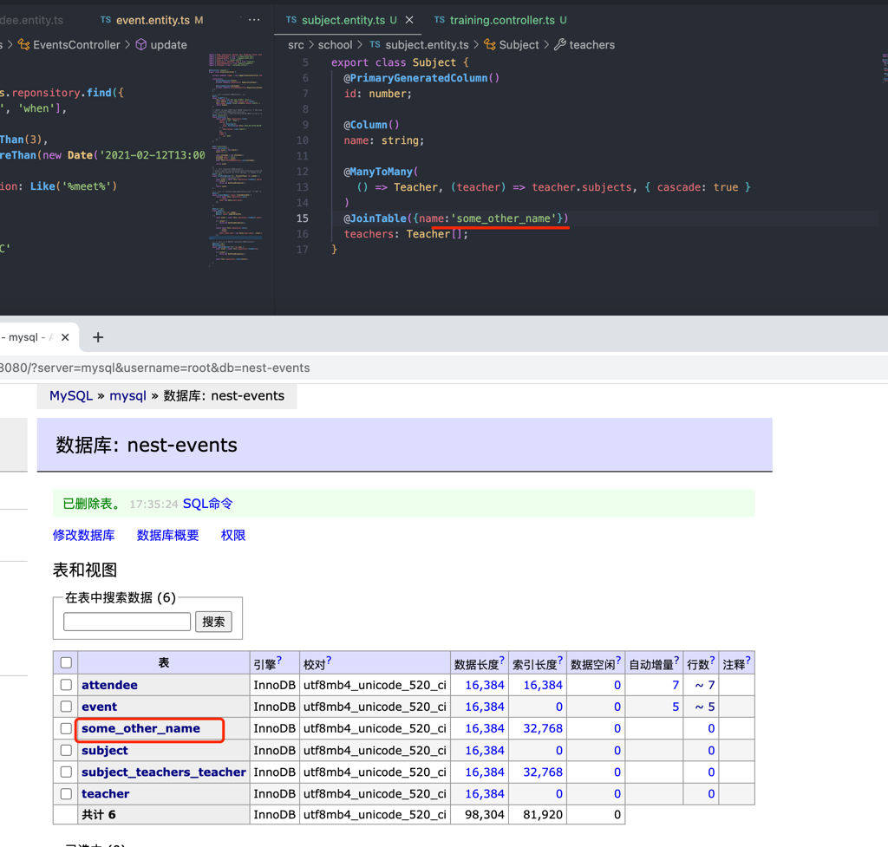


具体逻辑可以看这里:

https://github.com/richard1230/nest-events-backend/commit/608df9abfdfd53cdafad914d234596995845cd57


