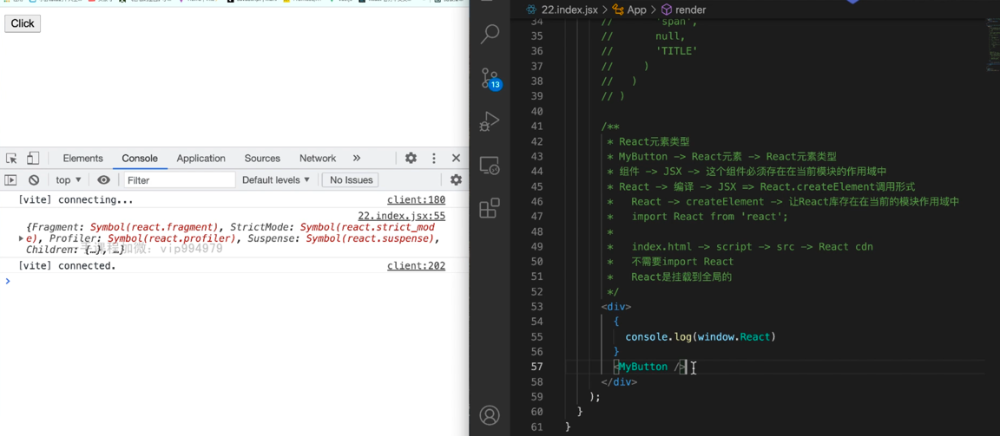
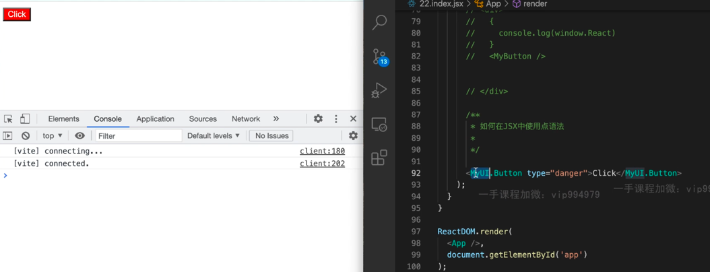
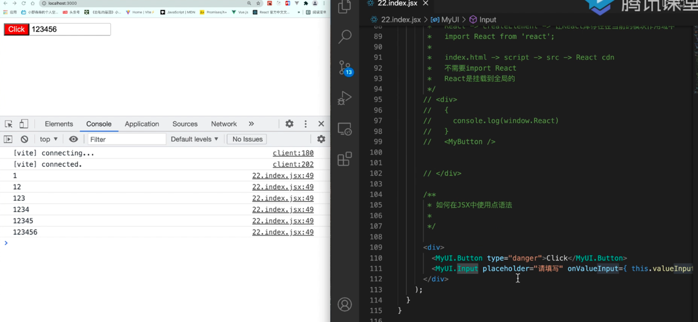
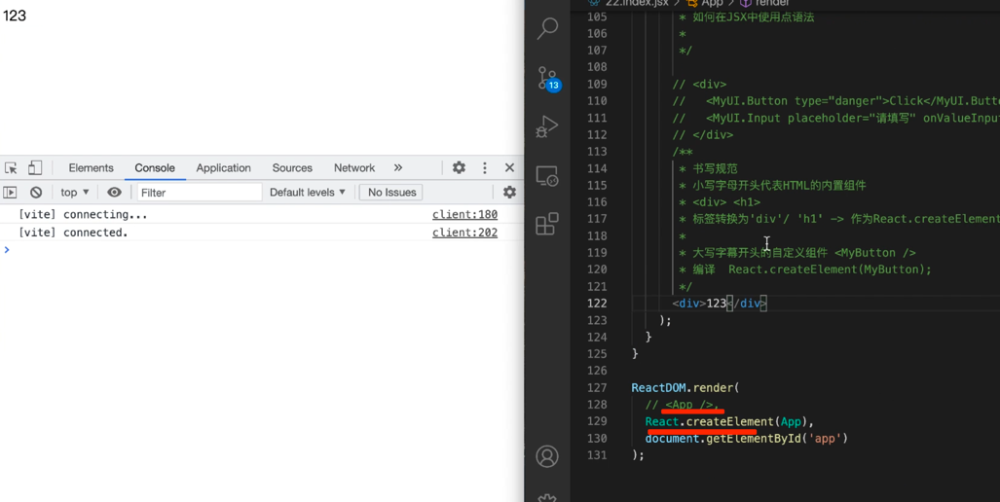
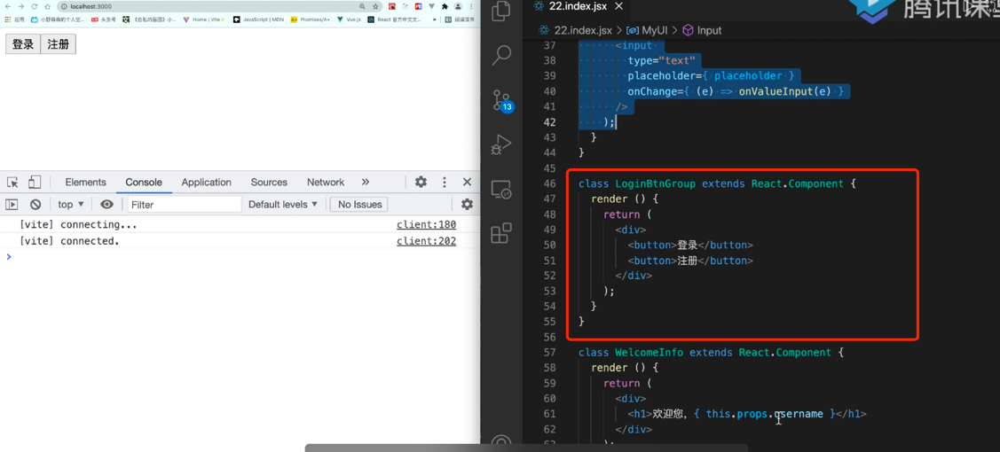
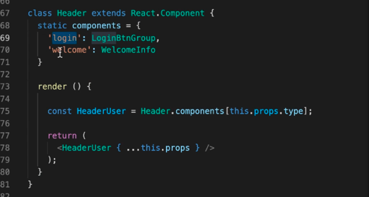
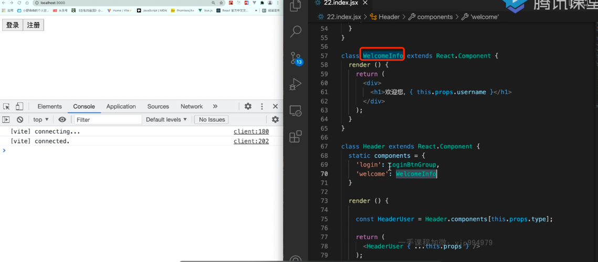
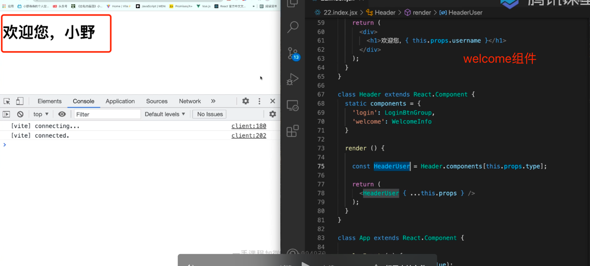
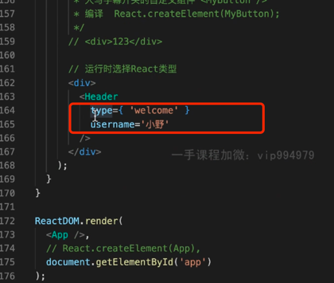
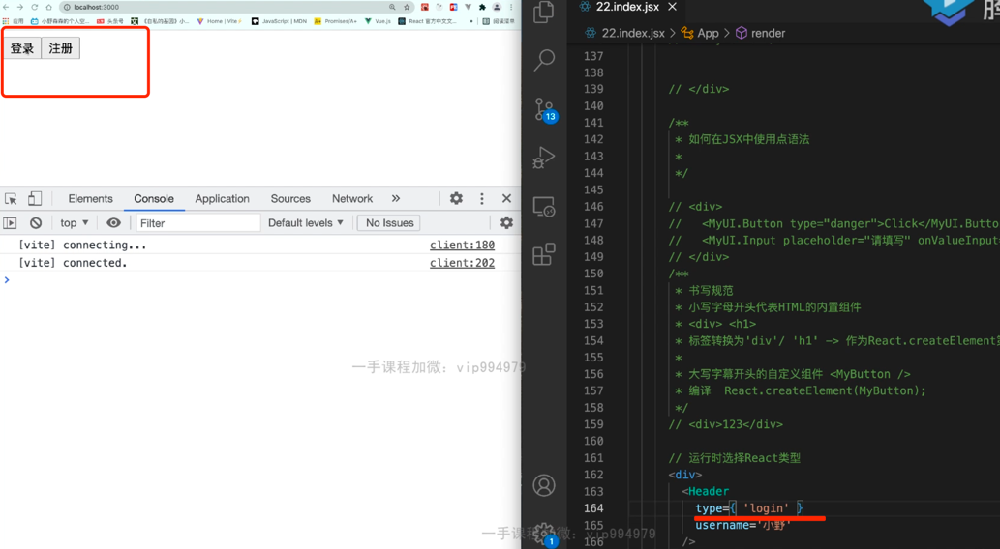

[TOC]

## Jsx本质

```jsx
class App extends React.Component {
  render() {
    return (
      <div className='box' id='J_Box'>
        <h1 className='title'>
          This is a <span>TITLE</span>
        </h1>
      </div>
    );
  }
}

ReactDOM.render(
  <App/>,
  document.getElementById('app')
)
```

return里面可以换一种写法:

```jsx
class App extends React.Component {
  render() {
    return (
      React.createElement(
        div,
        {
          className: 'box',
          id: 'J_Box'
        },
        // div(标签) , 属性,子元素
        React, createElement(
          'h1',
          {
            className: 'title'
          },
          'This is a',
          React.createElement(
            'span',
            null,
            'TITLE'
          )
        )
      )
    );
  }
}
```

### 小结

JSX其实是React.createElement函数调用的语法糖;

JSX ---> 编译 ---> React.createElement函数调用


## React元素类型

```jsx
class MyButton extends React.Compponent {

  render() {
    return (
      <button>Click</button>
    )
  }
}

class App extends React.Component {
  render() {
    return (
      <MyButton/>
    );
  }
}

```

React ---> 编译 ---> JSX ---> React.createElement调用形式

React ---> createElement ---> 让React库存在当前的模块作用域中

`import React from 'react'`(index.html---> script ---> src ---> React cdn 是不需要 import的)



## 如何在JSX中使用点语法

```jsx

const colorSystem = {
  'primary': 'blue',
  'success': 'green',
  'warning': 'orange',
  'danger': 'red'
}

const MyUI = {
  Button: class extends React.Component {
    render() {
      const {type, children} = this.props;

      return (
        <button
          style={{
            color: '#fff',
            backgroundColor: colorSystem[type]
          }}
        >
          {children}

        </button>
      )
    }
  },
  Input: function (props) {
    const {placeholder, onValueInput} = props;
    return (
      <input
        type="text"
        placeholder={placeholder}
        onCHange={(e) => onValueInput(e)}
      />
    )
  }
}

class App extends React.Component {
  render() {
    return (
      <div>
        <MyUI.Button
          type='danger'
        >
          Click
        </MyUI.Button>

        <MyUI.Input placeholder="请填写" onValueInput={this.valueInput}>
        </MyUI.Input>
      </div>

    );
  }
}
```





## JSX书写规范

小写字母开头代表HTML的内置组件,标签转换为 字符串: `div` =====> `'div'` --->作为React.createElement的第一个参数

大写字母开头代表自定义组件 , 例如 `MyButton`，编译 React.createElement(MyButton)



## 运行时选择组件











```jsx
class Login extends React.Component {
  render() {
    return (
      <div>
        <button>登陆</button>
        <button>注册</button>
      </div>
    )
  }
}

class welcome extends React.Component {
  render() {
    return (
      <div>
        <h1>欢迎您</h1>
      </div>
    )
  }
}

class Header extends React.Component {
  static components = {
    'login': Login,
    'welcome': welcome
  }

  render() {
    const HeaderUser = Header.components[this.props.type]
    return (
      <div>
        <HeaderUser {...this.props}/>
      </div>
    )
  }
}

class App extends React.Component {
  render() {
    return (
      <div>
        <Header
          type={'welcome'}
          // type={'login'}
          username='Richard'
        />
      </div>
    );
  }
}
```


