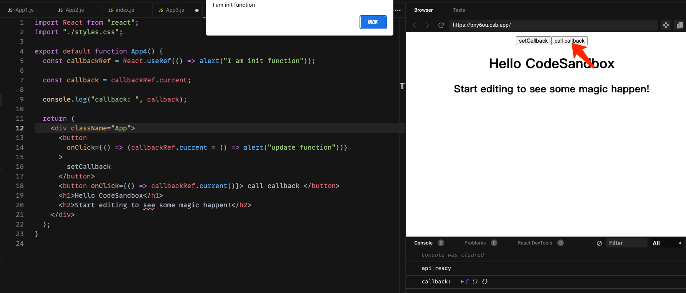
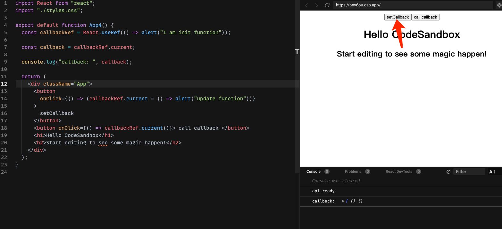
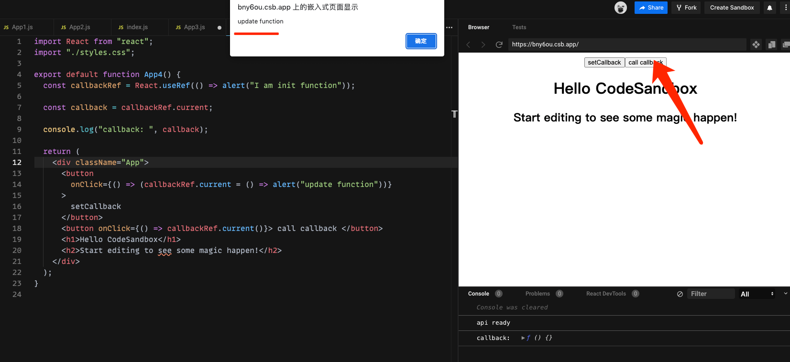

https://www.quora.com/How-can-you-change-only-one-property-of-an-object-using-the-USestate-hook-JavaScript-React-React-hooks-development

[TOC]

useState的坑-如何使用useState更改对象属性

## 前言

先看一个例子:


```js
const obj1 = {name: "Lily", age: 29}

const obj2 = {name: "Lily", age: 29}

console.log(obj1 === obj2); // false 

```


上面这个例子中为什么答案是false?

稍微有点编程经验的人都知道:这是因为在JavaScript中，当涉及到对象时，变量中存储的是对象的内存地址，而不是对象本身:

假设在南京路222号的房子里，住着一对叫Richard和Lucy的夫妇。我们将把它们表示为`{he:"Richard", she:"Lucy"}`。在南京路222号的隔壁223号，刚好住着另一对也叫Richard和Lucy的夫妇:`{he:"Richard", she:"Lucy"}`。
```js
const couple1 = {he:"Richard", she:"Lucy"} // 假设存储于内存地址 222 
const couple2 = {he:"Richard", she:"Lucy"} // 假设存储于内存地址 223

````
现在我们可以问couple1是否等于couple2。实际存储在这两个变量中的是222和223。222 与 223相等么？很显然不等。

在看一种原生类型的例子:

```js
const num1 = 6 
const num2 = 6

console.log(num1 === num2);//true
```
这里num1等于num2是由于基本类型是存储于栈中的,所有“等于”6的变量都指向同一个6,而分配给`{he:"Richard", she:"Lucy"}`的每个变量都指向不同的内存地址,如下所示:


```shell
const x → 6 ← const y

const a → memory address 123 → {he:"Richard", she:"Lucy"}
const b → memory address 456 → {he:"Richard", she:"Lucy"}
```

一般而言,在JS中:

numbers, strings, boolean这些基本类型的值是存储于栈中的;

而对象,数组以及函数类型这三种类型的值是存储于堆中的,在栈中存储的是地址.


## 实例

继续,再次看一个例子:

```js
const x = {color: "red", size: "large" }
const y = x 
x === y // true, 因为我们设置 y 指向了与 x 相同的内存地址 
z = {color: "red", size: "large" }
console.log(x === z); // false ,因为它们指向两个不同内存地址中的两个不同对象

```

下面来看一个React中的例子:
```jsx
const [value, setValue] = useState(17); 
// … 
<button onClick={() => setValue(v => v+1)}>click me</button>
```

单击按钮时，setValue将导致存储在钩子中的值发生变化(从17变为18)，这将使组件重新渲染。

再看一个例子:(重点来了)

```jsx
const [value, setValue] = useState({name: "Lily", age: 29}); 
// … 
<button onClick={() => setValue(v => v.age+1)}>click me</button> 
```

这将不会导致组件重新渲染，因为钩子的值(对象的地址)没有改变。是的，你已经更改了该对象的一个参数的值，但对象本身仍然存储在相同的地址。


还记得前面南京路的那个比喻么?如果住在南京路222号的Richard和Lucy离婚并搬出去，而Richard又和一个叫Lily的女人再婚`{he:"Richard", she:"Lily"}`，他们仍然住在南京路222号。

再看下面这个例子:

```jsx
const App = () => { 
  const [obj, setObj] = React.useState({name: "Lily", age: 29})   
  return ( 
  	<div> 
  	  <div>{JSON.stringify(obj)}</div> 
      <button onClick={() => setObj(v => { 
        console.log(v.age) //s1
      	v.age + 1 
        return v 
      })}>+</button> 
    </div> 
  ) 
}	
```


如果你反复点击按钮,你会发现页面中的29始终没变,为什么呢,因为useState中的初始状态为一个对象(而非常量),

对象的地址没变,所以Hooks认为啥都没变;

这里给出正确的写法:

```jsx
const App = () => { 
  const [obj, setObj] = React.useState({name: "Fred", age: 18}) 
   
  return ( 
  	<div> 
  	  <div>{JSON.stringify(obj)}</div>  
      <button onClick={() => setObj(obj => ({ ...obj, age: obj.age + 1})) //s2
      }>+</button> 
    </div> 
  ) 
}
```


这里实现了修改对象中属性值的目标,秘密在 s2那一行;


继续看下面这个例子:

```js
const obj11 = {foo:"bar"}

const obj22= obj11

console.log(obj11 === obj22)// true,这是由于obj11和obj22指向同一块地址


const obj1 = {foo:"bar"}

const obj2 = { ...obj1 }//这种是ES6写法

console.log(obj1 === obj2)// false,这是由于obj1和obj2分别是两块地址不同的内存
```
由此可以看出,发现obj1的地址是改变了的,变为obj2了,难怪上面例子中的useState会认为初始对象发生了改变!


这种方法的缺点是每次用户单击按钮时，都会生成对象的全新副本。这是有额外的内存开销的!但是一般情况下这不是问题,电脑的配置现在都不低


## 小结

上面主要梳理了一下当**useState的初始state**为**对象**的时候,怎么去修改对象属性,以及为什么要去这么做,最后给出一个解决方案:

```jsx

  const [obj, setObj] = React.useState({k1:"v1",k2:"v2"})
  
    ...
  <button onClick={() => setObj(obj => ({ ...obj, k2: obj.k2 + 1}))    }>+</button> 

```


## useState如何保存函数

先要明确一个概念:


useState右边括号中初始值为类似0这种类型的时候,其左边数组中初始值的类型也就为对应的number类型;

用一句简单的话来说,右边赋什么,左边就是什么,也就是说useState是能存储这些数据的,但是有一种类型除外,就是函数,见下图


当右边为函数的时候,左边居然为void类型,怎么解决??


只需将你想要保存的函数作为返回值即可!(其实这里利用了[惰性加载](https://zh-hans.reactjs.org/docs/hooks-reference.html#usestate),参见例a旁的注解)


```jsx
  const [fn,setFn ] = React.useState(()=>()=>{});

```
### useState中保存函数的实战与方案 

注意比较下面的两个例子:

例a:(注意:useState中的函数一开始渲染的时候回立即执行!就是说useState右边括号中的函数在组件的初始渲染中会立即执行)


例b:(完成了对函数的保存与更改)


```jsx
import React from "react";
import "./styles.css";

export default function App2() {
  const [fn, setFn] = React.useState(() => () => {
    alert("I am init function");
  });

  console.log("fn: ", fn);

  return (
    <div className="App">
      <button onClick={() => setFn(() => () => alert("update function"))}>
        setCallback
      </button>
      <button onClick={fn}> callback </button>
      <h1>Hello CodeSandbox</h1>
      <h2>Start editing to see some magic happen!</h2>
    </div>
  );
}

```


### 最佳解决方案(使用useRef)

使用useRef解决这个问题的坑:

```jsx
import React from "react";
import "./styles.css";

export default function App3() {
  const callbackRef = React.useRef(() => {
    alert("I am init function");
  });

  const callback = callbackRef.current

  console.log("callback: ", callback);

  return (
    <div className="App">
      <button onClick={() => (callbackRef.current=() => alert("update function"))}>
        setCallback
      </button>
      <button onClick={callback}> callback </button>
      {/*s12*/}
      <h1>Hello CodeSandbox</h1>
      <h2>Start editing to see some magic happen!</h2>
    </div>
  );
}

```


点击callback按钮:


点击setCallback：


再次点击callback按钮(发现没有变化,调用的还是原来的函数)


上面问题的原因是什么?

useRef不是state,用useRef定义的只是普通的变量,不是本组件的状态,useRef这个容器里保存的值改变的时候,state不会改变,故不会触发渲染;

故s12处的callback还是第一次渲染时的callback!怎么解决这个问题??

只要将改变之后的`callbackRef.current()`重新读取出来即可,而不是读取之前的那个值

https://codesandbox.io/s/billowing-bush-bny6ou?file=/src/App4.js

```jsx
import React from "react";
import "./styles.css";

export default function App4() {
  const callbackRef = React.useRef(() => alert("I am init function"));

  const callback = callbackRef.current;

  console.log("callback: ", callback);

  return (
    <div className="App">
      <button
        onClick={() => (callbackRef.current = () => alert("update function"))}
      >
        setCallback
      </button>
      {/*下面一行很重要!!!如果写成callbackRef.current也还是不行,这样读取的还是之前的值,并没有重新读取 */}
      <button onClick={() => callbackRef.current()}> call callback </button>
      <h1>Hello CodeSandbox</h1>
      <h2>Start editing to see some magic happen!</h2>
    </div>
  );
}

```










## 测试demo


https://codesandbox.io/s/billowing-bush-bny6ou?file=/src/App1.js


