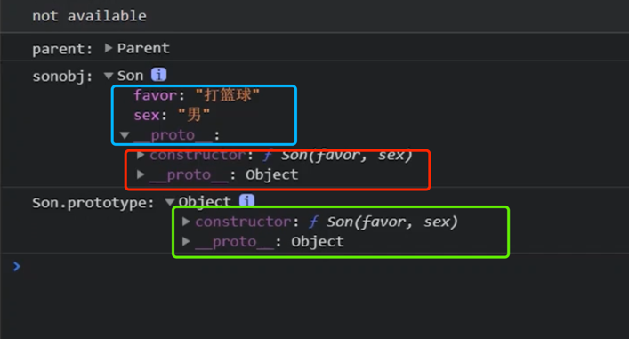
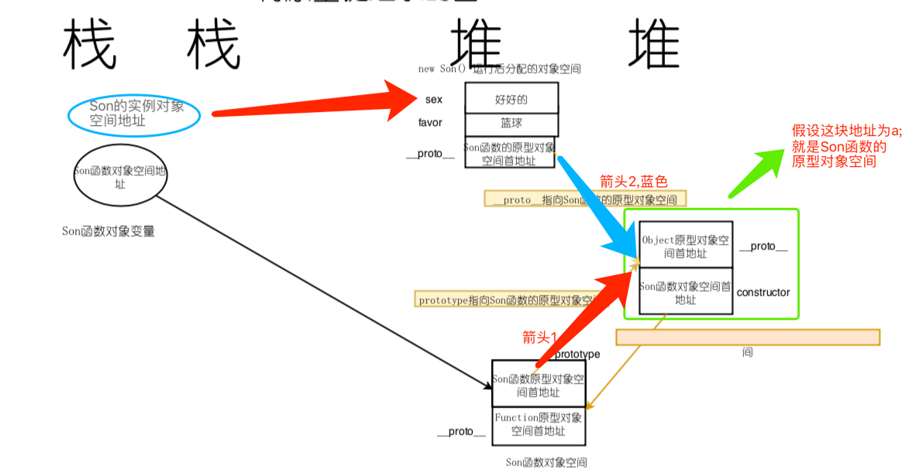
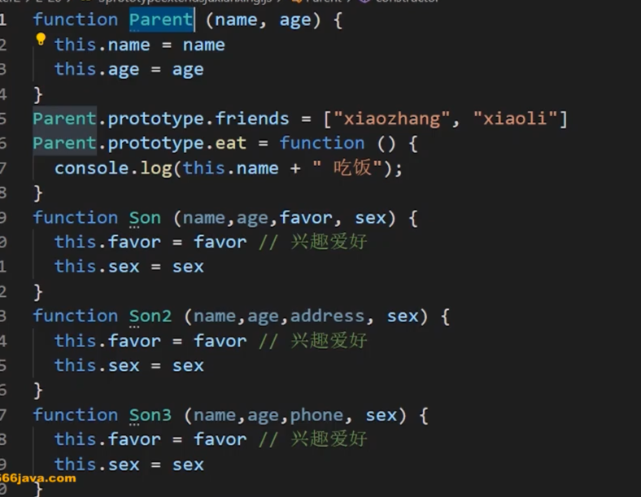
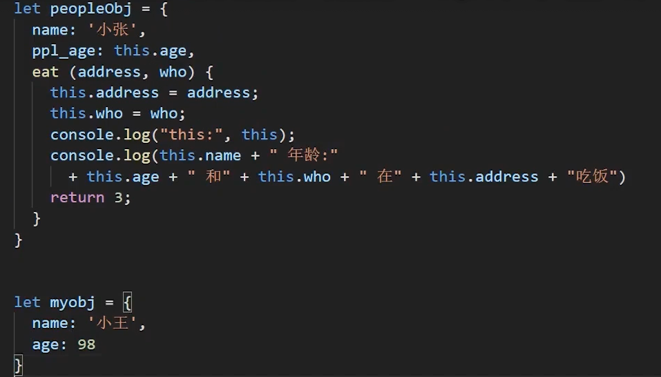
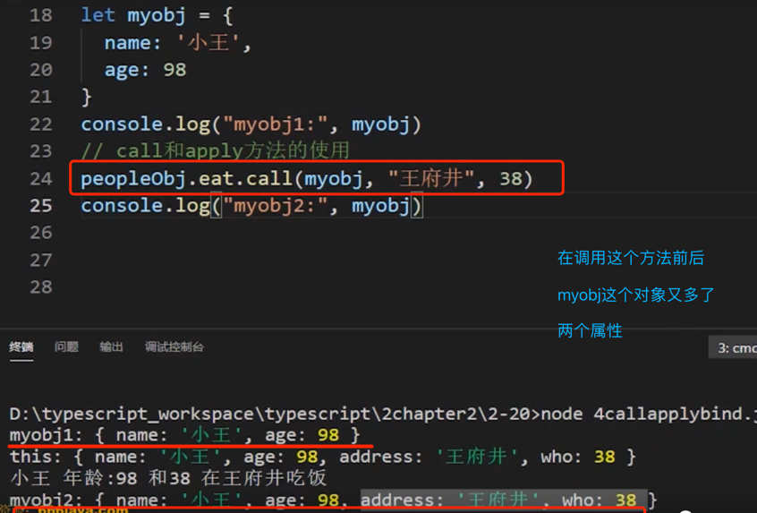
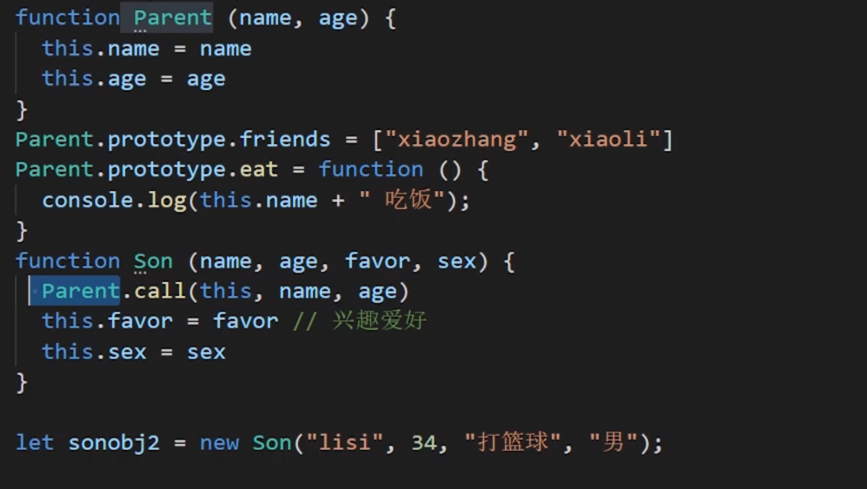
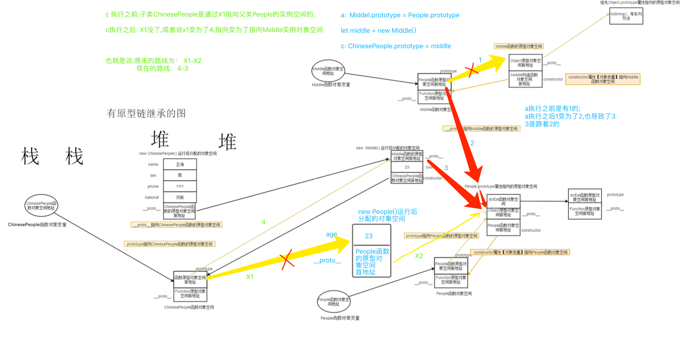

[TOC]

## 5-2原型链继承实现原理
原型链继承基本思想就是Son 类的原型对象属性【 Son.prototype 】指向 new  Parent( )。即 

```js
	function Parent(name,age){
        this.name=name
        this.age=age
    }
	function Son(favor,sex){
        this.favor=favor // 兴趣爱好
        this.sex=sex
    }
    let parent = new Parent('王五',23);
    console.log("parent: ",parent);
    let sonobj = new Son("打篮球","男");
    console.log("sonobj: ",sonobj);
    Son.prototype=new  Parent("王六",38) // 
   console.log("Son.prototype 原型链继承之后的指向: ",Son.prototype);

	// let sonObj=new Son("篮球","男")
```





图a(此图比较重要)


图b
### 容易忽略的知识点 

>上图a中,可以看出:`constructor`又会反向指向Son函数对象空间地址,上图中隐藏了一个非常重要的知识点:
> 看图b:构造函数prototype的指向决定最终实例对象中的`__proto__`的指向,就是说先有箭头1,箭头2的指向是跟着箭头1的,
>箭头1指向地址a,那么箭头2也指向地址a,箭头1指向某个地址z,那么箭头2也指向地址z


原型链继承（就是`Son.prototype=new Parent("王六",38)`,图中属性可能有差异,但是逻辑没问题）发生之后,发生了什么,看下图(重要):

其实就是Son类的prototype的指向发生了变化,从指向 Son函数 原型对象空间 变为了指向 Parent的实例对象的对象空间


## 5-3(有面试考点)
 
 实例对象(假设为son)在查找属性的时候,先在自己的对象空间中查找要访问的属性或方法，如果找到，就输出，如果没有找到,就沿着`__proto__`(它里面存放的是Son函数的原型对象空间)去上一级实例对象空间中去找,如果找到，就输出，如果没有找到,就去Parent(其实就是Son的上一级)的原型对象空间里面去找,如果还找不到,就去Object原型对象空间里面去找,还找不到,就输出null

原型链:沿着 `__proto__`去寻找继承关系的链条 就是原型链

原型链继承的完整描述:子对象首先在自己的对象空间中查找要访问的属性或方法，如果找到，就输出，如果没有找到，就沿着子对象中的`__proto__`属性指向的原型对象空间中去查找有没有这个属性或方法，如果找到，就输出，如果没有找到，继续沿着原型对象空间中的`__proto__`查找上一级原型对象空间中的属性或方法，直到找到Object.prototype原型对象属性指向的原型对象空间为止，如果再找不到，就输出null

一个容易忽略的知识 `Son.protype.constructor = Son`：


```js

function Parent (name, age) {
  this.name = name
  this.age = age
}
Parent.prototype.friends = ["xiaozhang", "xiaoli"]
Parent.prototype.eat = function () {
  console.log(this.name + " 吃饭");
}
function Son (favor, sex) {
  this.favor = favor // 兴趣爱好
  this.sex = sex
}
let parent = new Parent("王五", 23);
console.log("parent:", parent)
let sonobj = new Son("打篮球", "男");
console.log("sonobj:", sonobj)

console.log("Son.prototype:", Son.prototype)

Son.prototype = new Parent("王六", 38);

Son.protype.constructor = Son//aaa: 这一步不能漏掉！！！框架源码中一般很常见,见下图C

/*
let prototype = {};
prototype.constructor = 'abc'
等价于:
let prototype = {constructor:'abc'}
* */

console.log("Parent.prototype:", Parent.prototype)
console.log("Son.prototype 原型链继承之后的指向:", Son.prototype)
let sonobj2 = new Son("打篮球", "男");
console.log("sonobj2:", sonobj2)
console.log("sonobj2访问son类自身的favor属性【构造函数中this定义的对象属性】:", sonobj2.favor)
console.log("sonobj2访问son对象原型上的name属性:", sonobj2.name)//实际上sonobj2.name是Parent实例对象中的name
console.log("sonobj2访问friends属性:", sonobj2.friends) //实际上sonobj2.friends这个属性是Parent实例对象中__proto__的friends属性,也就是Parent的prototype的friends属性


```

图C(重要,请将其与图a/b对比,图C中的蓝色箭头是通过上面代码中的aaa处)

## 5-4
`Son.prototype = Parent.prototype; `的问题


## 5-5原型链继承的不足

局限性：不能通过子类构造函数向父类构造函数传递参数 




## 5-6借用构造函数

call和apply的使用:



```ts
let peopleObj ={
  name: '张三',
ppl_age: this.age,
  eat(address,who){
    this.address = address;
    this.who = who;
    console.log('peopleObj中的 this:  ',this);
    console.log(this.name + "年龄:" + this.age + " 和" + this.who + " 在" + this.address + "吃饭")
    return 3;
  }
}


let myobj = {
  name: '小王',
  age: 98
}


//myobj借用pelpleobj的eat方法
peopleObj.eat.call(myobj,"王府井","叫38的人")//小王年龄:98 和叫38的人 在王府井吃饭

peopleObj.eat.apply(myobj,["王府井","叫38的人"])

```



myobj借用了peopleObj的函数和属性


## 5-7借用构造函数




```ts
function Parent(name,age) {
  this.name = name
  this.age = age
}

Parent.prototype.friends = ["xz",'xl' ]
Parent.prototype.easing = function () {
  console.log(this.name + "吃饭")
}


function Son(name,age,favor,sex) {
  Parent.call(this,name,age)
  this.favor = favor
  this.sex = sex
}

```

## 5-8 借用构造函数+原型链继承组合


```ts
function Parent(name,age) {
  this.name = name
  this.age = age
}

Parent.prototype.friends = ["xz",'xl' ]
Parent.prototype.easing = function () {
  console.log(this.name + "吃饭")
}


function Son(name,age,favor,sex) {
  Parent.call(this,name,age)//调用了一次
  this.favor = favor
  this.sex = sex
}

//又调用了一次Parent
Son.prototype = new Parent('wangwu',23)//这里的Parent中的参数不起作用,其实,但是这里的原型链继承很重要!!!
Son.prototype.constructor = Son //这行不能忘记

let sonobj2 = new Son('Lisi',34,"打篮球",'男')
```
这种方式的优缺点:

（1）借用构造函数+原型链继承组合模式的优势

优势1：具备借用构造函数的优点：子类的内部可以向父类【  Parent 构造函数】 传递参数

优势2：具备原型链继承的优点：Son.prototype 和 new Parent( ) 出来的实例对象变量和实例都可以访问父类【  Parent 构造函数】 原型对象上的属性和方法。


缺点：调用了两次父类构造函数 【 Parent 构造函数】 new People 调用构造函数带来问题：

1. 进入 Parent 构造函数为属性赋值，分配内存空间，浪费内存；
2. 赋值导致效率下降一些，关键是new Parent 赋的值无意义，出现代码冗余，new Parent出来的对象和这些值毫不相干，是通过子类 Son 构造函数中的 apply 来向父类Parent构造函数赋值。


## 5-9 寄生组合 方式

看个例子

```ts
function People (name, sex, phone) {//父类 【父构造函数】
  this.name = name;
  this.sex = sex;
  this.phone = phone;
}

People.prototype.doEat = function () {
  console.log(this.name + "吃饭...")
}

function ChinesePeople (name, sex, phone, national) {//ChinesePeople子类【子构造函数】

  People.call(this, name, sex, phone)
  this.national = national;//民族
}
//寄生组合继承实现步骤
// 第一步: 创建一个寄生构造函数
function Middle () {
  this.count = 23 
}

Middle.prototype = People.prototype//这一步很重要
// 第二步:创建一个寄生新创建的构造函数的对象
let middle = new Middle();
// 第三步:ChinesePeople子类的原型对象属性指向第二步的新创建的构造函数的对象
ChinesePeople.prototype = middle


let chinesePeopleTwo = new ChinesePeople("王海", "男", "1111", "汉族");
let chinesePeopleOne = new ChinesePeople("约克夏", "女", "1111", "傣族");

console.log("chinesePeopleOne:", chinesePeopleOne);
console.log("chinesePeopleTwo:", chinesePeopleTwo);


```




 


