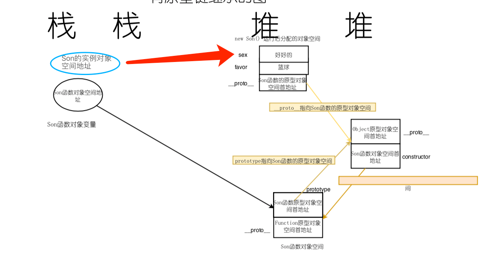

[TOC]

## 原型链继承实现原理
原型链继承基本思想就是Son 类的原型对象属性【 Son.prototype 】指向 new  Parent( )。即 

```js
	function Parent(name,age){
        this.name=name
        this.age=age
    }
	function Son(favor,sex){
        this.favor=favor // 兴趣爱好
        this.sex=sex
    }
    let parent = new Parent('王五',23);
    console.log("parent: ",parent);
    let sonobj = new Son("打篮球","男");
    console.log("sonobj: ",sonobj);
    Son.prototype=new  Parent("王六",38) // 
   console.log("Son.prototype 原型链继承之后的指向: ",Son.prototype);

	// let sonObj=new Son("篮球","男")
```




图a(此图比较重要)


图b
### 容易忽略的知识点 

>上图a中,可以看出:`constructor`又会反向指向Son函数对象空间地址,上图中隐藏了一个非常重要的知识点:
> 看图b:构造函数prototype的指向决定最终实例对象中的`__proto__`的指向,就是说先有箭头1,箭头2的指向是跟着箭头1的,
>箭头1指向地址a,那么箭头2也指向地址a,箭头1指向某个地址z,那么箭头2也指向地址z


原型链继承（就是`Son.prototype=new Parent("王六",38)`,图中属性可能有差异,但是逻辑没问题）发生之后,发生了什么,看下图(重要):


