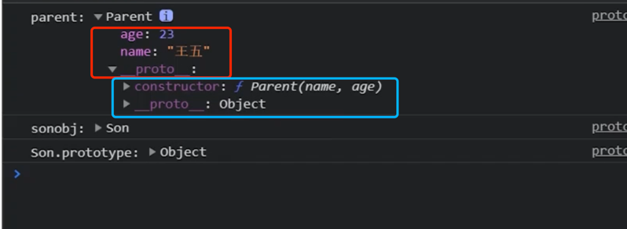
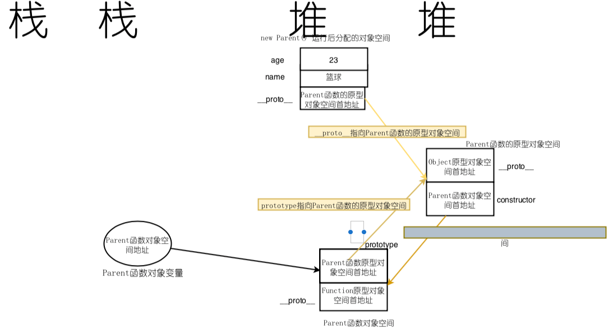

[TOC]

## 5-2原型链继承实现原理
原型链继承基本思想就是Son 类的原型对象属性【 Son.prototype 】指向 new  Parent( )。即 

```js
	function Parent(name,age){
        this.name=name
        this.age=age
    }
	function Son(favor,sex){
        this.favor=favor // 兴趣爱好
        this.sex=sex
    }
    let parent = new Parent('王五',23);
    console.log("parent: ",parent);
    let sonobj = new Son("打篮球","男");
    console.log("sonobj: ",sonobj);
    Son.prototype=new  Parent("王六",38) // 
   console.log("Son.prototype 原型链继承之后的指向: ",Son.prototype);

	// let sonObj=new Son("篮球","男")
```




图a(此图比较重要)


图b
### 容易忽略的知识点 

>上图a中,可以看出:`constructor`又会反向指向Son函数对象空间地址,上图中隐藏了一个非常重要的知识点:
> 看图b:构造函数prototype的指向决定最终实例对象中的`__proto__`的指向,就是说先有箭头1,箭头2的指向是跟着箭头1的,
>箭头1指向地址a,那么箭头2也指向地址a,箭头1指向某个地址z,那么箭头2也指向地址z


原型链继承（就是`Son.prototype=new Parent("王六",38)`,图中属性可能有差异,但是逻辑没问题）发生之后,发生了什么,看下图(重要):

其实就是Son类的prototype的指向发生了变化,从指向 Son函数 原型对象空间 变为了指向 Parent的实例对象的对象空间


## 5-3(有面试考点)
 
 实例对象(假设为son)在查找属性的时候,先在自己的对象空间中查找要访问的属性或方法，如果找到，就输出，如果没有找到,就沿着`__proto__`(它里面存放的是Son函数的原型对象空间)去上一级实例对象空间中去找,如果找到，就输出，如果没有找到,就去Parent(其实就是Son的上一级)的原型对象空间里面去找,如果还找不到,就去Object原型对象空间里面去找,还找不到,就输出null

原型链:沿着 `__proto__`去寻找继承关系的链条 就是原型链

原型链继承的完整描述:子对象首先在自己的对象空间中查找要访问的属性或方法，如果找到，就输出，如果没有找到，就沿着子对象中的`__proto__`属性指向的原型对象空间中去查找有没有这个属性或方法，如果找到，就输出，如果没有找到，继续沿着原型对象空间中的`__proto__`查找上一级原型对象空间中的属性或方法，直到找到Object.prototype原型对象属性指向的原型对象空间为止，如果再找不到，就输出null
```js
function Parent (name, age) {
  this.name = name
  this.age = age
}
Parent.prototype.friends = ["xiaozhang", "xiaoli"]
Parent.prototype.eat = function () {
  console.log(this.name + " 吃饭");
}
function Son (favor, sex) {
  this.favor = favor // 兴趣爱好
  this.sex = sex
}
let parent = new Parent("王五", 23);
console.log("parent:", parent)
let sonobj = new Son("打篮球", "男");
console.log("sonobj:", sonobj)

console.log("Son.prototype:", Son.prototype)

Son.prototype = new Parent("王六", 38);


console.log("Parent.prototype:", Parent.prototype)
console.log("Son.prototype 原型链继承之后的指向:", Son.prototype)
let sonobj2 = new Son("打篮球", "男");
console.log("sonobj2:", sonobj2)
console.log("sonobj2访问son类自身的favor属性【构造函数中this定义的对象属性】:", sonobj2.favor)
console.log("sonobj2访问son对象原型上的name属性:", sonobj2.name)//实际上sonobj2.name是Parent实例对象中的name
console.log("sonobj2访问friends属性:", sonobj2.friends) //实际上sonobj2.friends这个属性是Parent实例对象中__proto__的friends属性,也就是Parent的prototype的friends属性


```


