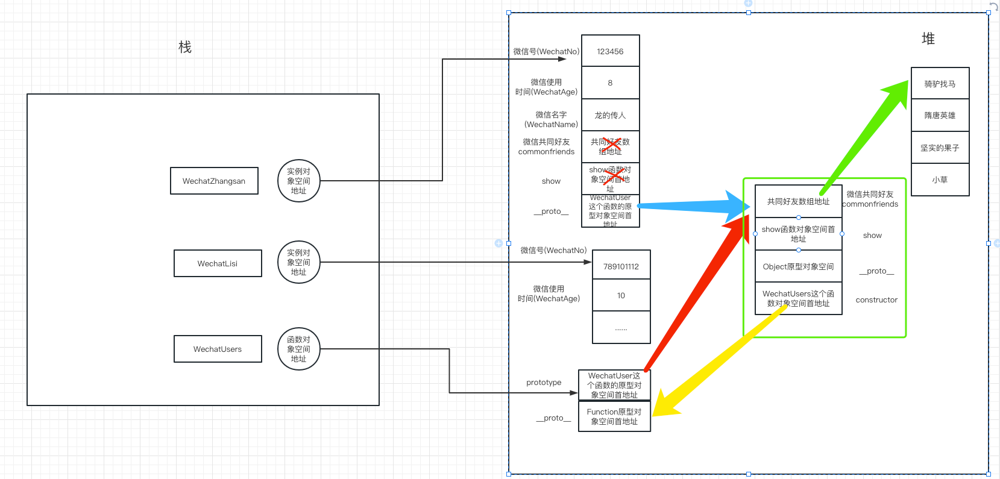

1、所有的引用类型（数组、对象、函数），都具有对象特性，即可自由扩展属性（除了“null”以外）

2、所有的对象，都有一个__proto__（隐式原型）属性，属性值是一个普通的对象

3、所有的函数，都有一个 prototype（显式原型） 属性，属性值也是一个普通的对象

4、所有的引用类型（数组、对象、函数），__proto__属性值指向它的构造函数的“prototype”属性值

5、当试图得到一个对象的某个属性时 ，并且这个对象本身没有这个属性，那么会去它的__proto__（即它的构造函数的prototype）中寻找。

